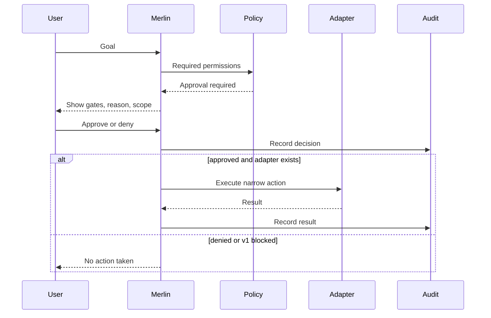

# Agent Permission Model

Last updated: 2026-05-06

## Principle

Agents are capabilities, not authorities. Merlin may plan and recommend, but the user grants permission before actions change local state, read sensitive data, call external systems, or run tools.

## Permissions

| Permission | Default | Approval | Logging | Risk |
| --- | --- | --- | --- | --- |
| `read_files` | Deny outside approved scope | Required for project/private files | File class and scope only | Medium |
| `write_files` | Deny | Required per task | Path hash/scope and summary | High |
| `run_shell` | Deny | Required per command | Command hash, purpose, result | High |
| `use_network` | Deny external | Required for external network | Domain/provider, no payload secrets | High |
| `use_browser` | Deny | Required per session | URL/domain and action summary | High |
| `call_external_api` | Deny | Required per provider/action | Provider, route, cost class | High |
| `write_memory` | Deny | Required per memory item | Approval ID and metadata | Medium |
| `install_dependencies` | Deny | Required per package set | Package names and manager | High |
| `modify_security_settings` | Deny | Required and normally blocked in v1 | Full audit | Critical |

## Agent Types

| Agent | v1 State | Allowed v1 Behavior | Blocked v1 Behavior |
| --- | --- | --- | --- |
| Planner | Enabled | Plan steps, explain risk | Execute steps |
| Researcher | Limited | Plan local search route | External search without approval |
| Coding | Planning only | Explain code plan, show approval gates | OpenHands/file/shell/git execution |
| File/document | Limited | Summarize approved content | Read arbitrary private folders |
| Security reviewer | Enabled for analysis | Review visible configs/docs | Change security settings |
| Operator | Planning only | Explain service/workflow steps | Start services or n8n workflows |
| Companion/Pi-style | Prompt behavior only | Warmth, context, humility | Emotional manipulation or unsupported claims |

## Approval Flow

## v1 Rule

No autonomous agents. No background agents. No persistent agent loops. Agent behavior in v1 is planning, explanation, and approval discovery only unless a narrow read-only action already exists.
