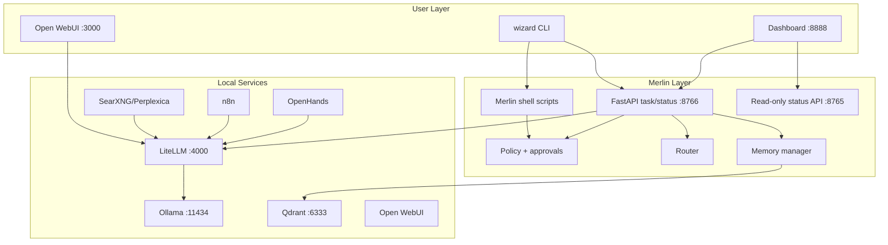
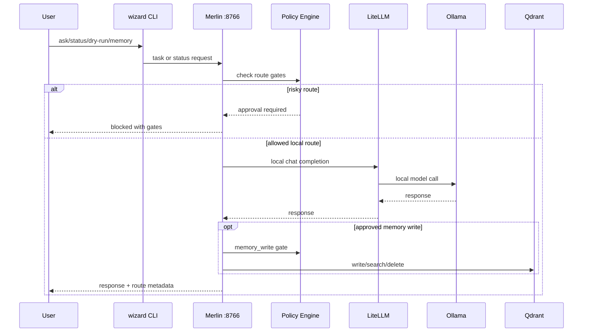

# Current Architecture

Last updated: 2026-05-06

## What The Repo Is Today

The repo is a local-first AI stack with a protected installer plus an emerging Merlin control layer.

It is already more than a one-shot installer because it includes:

- Profile-aware service startup.
- Runtime diagnostics.
- Memory read/write tools.
- Policy-gated dry-run and approvals.
- Plan-only Magic Mode.
- Merlin Python task/status API.
- CI and security scanning.

It is not yet a polished Merlin product because the user-facing loop is still split between Open WebUI, `wizard ask`, legacy swarm/n8n paths, Merlin scripts, and the dashboard.

## Runtime Components

| Component | Current Role | State |
| --- | --- | --- |
| Installer | Sets up local stack and profiles | Working, protect |
| Docker Compose | Service graph | Working, protect |
| Ollama | Local model runtime | Working, native on macOS |
| LiteLLM | Local-first model gateway | Working |
| Open WebUI | Chat UI | Working |
| Qdrant | Vector memory | Working |
| n8n | Optional automation/swarm workflows | Existing, optional |
| OpenHands | Optional coding agent | Existing, high risk |
| Dashboard | Static local status UI | Working but not full Merlin product UI |
| Merlin scripts | Dry-run, approvals, memory, Magic plan | Useful shell control layer |
| Merlin Python core | Config/policy/router/memory/persona/task/status | Built and tested |

## Current System Diagram

## Current Data Flow

## Architectural Tension

The current architecture has two control layers:

- Legacy shell-first Merlin scripts.
- New Python FastAPI Merlin core.

That is acceptable during transition, but v1 should make the product entrypoint clear. The safest path is to keep shell scripts for operational tasks and use Python core for task routing, policy, persona, and status.
