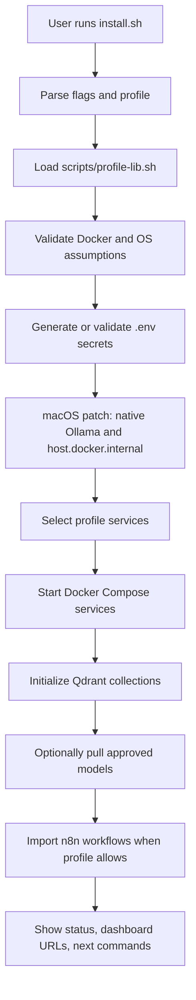
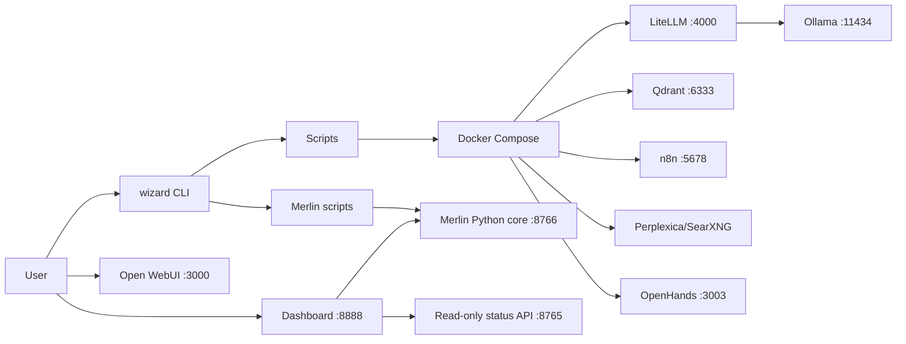

# Baseline Installer Review

Last updated: 2026-05-06

## Current Diagnosis

`home-ai-elite` is no longer only an installer, but the installer is still the protected delivery spine. The repo now contains:

- A working profile-aware installer.
- Docker Compose service graph.
- Wizard CLI.
- Merlin shell control scripts.
- Merlin Python core modules.
- Local memory, routing, policy, persona, status, and diagnostics.
- Dashboard assets and status APIs.
- CI, secret scanning, smoke tests, and release/package scripts.

The installer should be kept and protected. Merlin should grow around it through small wrappers, status surfaces, and policy-gated adapters.

## Repo Structure

| Path | Purpose | Notes |
| --- | --- | --- |
| `install.sh` | Main install entrypoint | Protected asset. Handles macOS native Ollama, profile selection, model pull policy, Docker checks, secrets, Qdrant bootstrap. |
| `docker-compose.yml` | Service graph | Protected asset. Services are localhost-bound by env defaults. |
| `cli/wizard` | User CLI | Existing control surface for start/stop/status, Merlin dry-run, approvals, memory, doctor, report-bug. |
| `scripts/` | Operational scripts | Start profiles, backup/restore, status, doctor, Merlin approval/memory/Magic plan scripts. |
| `merlin/` | Python core | Config loader, policy engine, router, memory manager, persona injector, FastAPI task/status endpoints. |
| `configs/merlin/` | Canonical Merlin config | Runtime source of truth. Root `config/` must not exist. |
| `dashboard/` | Static dashboard | Current UI is read-only/status-oriented. |
| `n8n-workflows/` | Workflow automation | Existing swarm/coordinator behavior should remain until replaced deliberately. |
| `tests/` | Smoke and pytest coverage | Enforces installer, config root, policy, memory, status, CI, package, and Merlin behavior. |
| `.github/workflows/` | CI/release automation | Includes shell, compose, static tests, Python tests, secret scans. |

## Installer Flow Summary

## Services And Ports

| Port | Service | Role | Default Exposure |
| --- | --- | --- | --- |
| 80/443 | Nginx | Optional local reverse proxy | Env-bound, default localhost |
| 3000 | Open WebUI | Chat UI | localhost |
| 3001 | Perplexica backend | Optional search backend | localhost |
| 3002 | Perplexica frontend | Optional search UI | localhost |
| 3003 | OpenHands | Optional coding agent | localhost |
| 4000 | LiteLLM | Model gateway | localhost |
| 5678 | n8n | Optional automation | localhost |
| 6333 | Qdrant REST | Vector memory | localhost |
| 8080 | SearXNG | Optional local search | localhost |
| 8765 | Merlin legacy status API | Read-only health/status | localhost |
| 8766 | Merlin task API | Execution-aware FastAPI task/status panels | localhost |
| 8888 | Dashboard | Local dashboard | localhost |
| 11434 | Ollama | Local model runtime | localhost/native on macOS |

## What Currently Works

- Profile-aware install and start scripts.
- macOS native Ollama path for Apple Silicon.
- Docker Compose validation and localhost bind defaults.
- Qdrant collection initialization and memory read/write scripts.
- `wizard doctor`, `wizard report-bug`, and redaction layer.
- Merlin Phase 2 Python core: config loader, policy, router, memory, persona, task endpoint, status extension.
- Magic Mode plan-only scripts.
- Approval request/review/audit scripts.
- CI with shell, compose, static smoke, Python tests, and gitleaks.

## Fragile Areas

- `install.sh` is large and critical; broad edits are risky.
- macOS Docker Desktop and native Ollama bridge assumptions must be retested after OS/Ollama/Docker upgrades.
- Low-memory Macs can suffer if optional profiles start together.
- n8n/OpenHands are powerful but heavy and should remain optional.
- Qdrant `documents` uses 1536 dimensions while most Merlin memory uses 768; guards must stay.
- Port 8765 and 8766 responsibilities must remain separate.
- Root `config/` must not be reintroduced; `configs/` is canonical.

## Network Assumptions

- Local services should bind to `127.0.0.1` by default.
- macOS containers reach native Ollama through `host.docker.internal`.
- Cloud provider keys can exist but cloud behavior must remain optional and off by default.
- Model downloads require explicit user intent.

## Security Assumptions

- Secrets are generated into `.env`, not committed.
- Logs and reports must redact secrets.
- Risky Merlin actions require approval gates.
- No raw user input should be stored in traces.
- Dashboard should not expose secrets or become a privileged control plane without a dedicated review.

## Baseline Architecture

