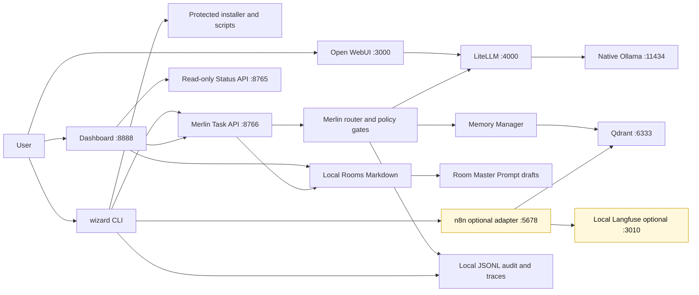

# Canonical Project State

Last verified: 2026-05-10

This document is the tie-breaker when roadmap notes, phase prompts, patent notes,
or older architecture docs disagree. Start from GitHub issue and milestone state,
then reconcile Markdown docs to that verified state.

## Source Of Truth Order

1. GitHub milestones and issues.
2. Recent commits and GitHub Actions results.
3. `docs/MASTER_CONTEXT.md`, `docs/MASTER_PROMPT.md`, and
   `CODEX_MASTER_PROMPT.md`.
4. `docs/MERLIN_IMPLEMENTATION_ROADMAP.md`.
5. Topic docs under `docs/architecture/`, `docs/security/`, `docs/product/`,
   `docs/engineering/`, and `docs/ip/`.
6. Archived point-in-time docs under `docs/archive/`.

If a lower source conflicts with a higher source, update the lower source or
open a GitHub issue. Do not follow stale phase prompts.

## Current Product Reality

Merlin AI / Home AI Elite has a working local-first foundation:

- protected installer and uninstall/upgrade paths,
- local Ollama, LiteLLM, Open WebUI, Qdrant, optional n8n, and Merlin APIs,
- Merlin Staff Core with config validation, policy gates, routing, memory,
  persona injection, task endpoint, and status panels,
- Phase 3 review-first learning loops,
- local JSONL observability baseline plus optional self-hosted Langfuse profile,
- Wizard HQ Merlin-native tab shell with Chat, Brains, Memory, Agents,
  Security, System, and Settings information architecture,
- Merlin Rooms initialized under `~/Merlin/brain/rooms`, with a default
  `merlin-build` Room, local transcript save flow, and session-local Room
  launcher in Wizard HQ,
- approval-gated Room transcript saves through the 8766 Task API, writing local
  Markdown history only and not approved memory,
- one-time task-route approvals through the 8766 Task API for local model
  responses on the same prompt/session only; they do not enable browser-side
  tool execution, file reads, shell commands, memory writes, cloud calls, or
  permanent approvals,
- approval-gated Room Master Prompt draft generation under
  `master-prompts/master-prompt.md`; drafts are local artifacts only and are not
  approved for context reuse,
- a Round Table agent governance spec that keeps project agents suggest-only by
  default and blocks runtime agent execution until future approval-gated work,
- read-only provider connector capability catalog for local Ollama, LiteLLM,
  ChatGPT/OpenAI, Claude/Anthropic, Perplexity Sonar, Gemini/Google AI,
  Mistral AI, and OpenRouter,
- a backend-only provider connector presence-marker setup path for #117 that
  requires approval metadata and never returns or persists raw provider keys.

It is not yet the final commercial Home AI Elite product. The remaining product
gaps are Merlin-native local chat history, Rooms/project context, save-to-Room
flow, approved memory extraction, memory review/delete, export/import brain,
dashboard command-center polish, visual Wizard HQ validation, and public
packaging evidence. Developer ID signing/notarization remains tracked by #64
but is deferred until the product surface is more complete.

The current product soul is governed by `docs/product/PRODUCT_NORTH_STAR.md`:
Merlin must become the user-owned AI chat, memory, project context, and action
surface before future web comprehension, automation runtime, governance
reporting, or public-release polish takes priority.

## Current Architecture Diagram

This is current-state as of 2026-05-10.

## Milestone Snapshot

| Milestone | State | Notes |
| --- | --- | --- |
| `v1.0 — Stable Installer Release` | Closed | Low/core 8GB Mac validation complete; Developer ID signing deferred to #64. |
| `v1.1 — Mobile Access + Remote-Safe Entry Points` | Closed | Design-only, opt-in LAN/mobile access; no default exposure. |
| `v1.2 — Hardware Guide + Document Ingestion Planning` | Closed | 8GB-first guidance and planning-only ingestion scope. |
| `v1.3 — Reliability + Memory + Router` | Closed | n8n retry contracts and local-first ModelRouter starter complete. |
| `v1.5 — Memory Benchmarking` | Closed | Offline deterministic benchmark harness complete. |
| `v1.6 — Pi Intelligence + Observability` | Complete after #8 closure | JSONL baseline, optional local Langfuse profile/export, n8n trace emission, memory/benchmark metadata export, and Qdrant task-signature retrieval are complete. |
| `v1.7 — Security Hardening` | Closed | #80 added the explicit fail-closed `webhook_execution` gate without changing webhook defaults. |
| `v2.0 — Merlin Staff Core` | Mostly complete, memory follow-ups open | Phase 2 runtime complete; stale roadmap/queue/governance issues were closed on 2026-05-08. Remaining work is explicit user-facing memory approval and memory review/delete. |
| `v2.1 — Dashboard Command Center` | Closed | Read-only Wizard HQ command center and security approvals panel complete. |
| `v2.2 — Magic Mode` | Closed | Plan-only Magic Mode and local redacted audit viewer complete. |
| `v3.0 — Public Product Release` | Active | Public packaging, onboarding, signing/notarization, installer branding, and release readiness. |
| `v3.1 — Wizard HQ Product Shell` | Active | Merlin-native Chat, Brains, Settings, provider capability catalog, and policy-gated setup flows under #106. |
| `v3.x — Native Automation Runtime` | Future | Last-mile commercial runtime to supplement or replace n8n after core workflows prove the owned shape. |

## Active Execution Queue

1. #122/#123/#134: keep the product focus on the local brain value loop:
   install, open Wizard HQ, select/create a Room, save local context, ask
   Merlin, see local/private proof, and review/delete/export what was stored.
2. #135: Merlin Rooms for local chat history and scoped context. Current slices
   created the default Room layout, named local Room creation, session Room
   launcher, user-initiated approval-gated transcript saves, one-time
   transcript reopen/delete approvals, safe transcript metadata titles,
   approval-gated Room Master Prompt drafts, and a metadata-only Room review
   table. Next slices should add duplicate/similar-Room suggestions before
   creating new Rooms, whole-Room archive/delete through a linked-memory review,
   and a separate approve-for-context gate before any Room content is reused.
3. #106: Wizard HQ Product Shell parent; keep Chat, Brains, Memory, Agents,
   Security, System, and Settings aligned before deeper governance features.
4. #31/#32/#120: memory approval, review, and delete paths. These are required
   before Merlin can honestly claim it learns durably from approved Room
   content.
5. #130: brain/context storage location UI, read-only first, so users can see
   where Merlin keeps Rooms, memory artifacts, and future exports.
6. #129: Fast/Smart model selection UI. Keep raw model names out of the normal
   user path; actual routing still belongs to Merlin.
7. #133: Round Table agent governance. The doc exists; next runtime work should
   be a read-only Wizard HQ panel only, not agent execution.
8. #114: policy-gated Wizard HQ Settings backend parent.
9. #117: provider connector setup with secret presence-only storage and
   explicit allow/not-allow flow. Backend presence-marker setup exists; Wizard
   HQ UI and real secret-vault/cloud-routing slices remain separate.
10. #119: startup/API service controls as a separate policy-gated Settings slice.
11. #37 and #95: public onboarding hardening and product audit evidence
   collection under v3.0.
12. #64: Developer ID signing/notarization under v3.0, deferred until the
   installer, Wizard HQ, and release evidence are otherwise product-complete.
13. #92: Native Automation Runtime in v3.x after release readiness work and
   control-plane product milestones.

Patent/IP issues #81 through #84 are cross-cutting governance work. They should
not add novel claim language to public docs unless the inventor explicitly
approves the disclosure and the relevant evidence exists in code.

## Canonical Docs

| Doc | Owner | Purpose |
| --- | --- | --- |
| `docs/CANONICAL_PROJECT_STATE.md` | Scrum master / governance | Current GitHub-aligned state, queue, and doc hierarchy. |
| `docs/product/PRODUCT_NORTH_STAR.md` | Product owner | Canonical product soul: Merlin as local chat, memory, Rooms, export/import brain, and supervised action surface. |
| `docs/MASTER_CONTEXT.md` | Session bootstrap | Full operational context and current milestone position. |
| `docs/MASTER_PROMPT.md` | Session bootstrap | Agent behavior rules and current next recommendation. |
| `CODEX_MASTER_PROMPT.md` | Root repo operating contract | High-level security, engineering, and patent-sensitive rules. Treat embedded backlog lists as subordinate to GitHub truth and this doc. |
| `docs/MERLIN_IMPLEMENTATION_ROADMAP.md` | Roadmap | Milestone ladder, issue alignment, and long-range execution plan. |
| `docs/product/MERLIN_CONTROL_PLANE_STRATEGY.md` | Product strategy | Validated control-plane direction, current/future boundary, and v3.1-v4.x milestone ladder. |
| `docs/product/PROVIDER_CONNECTOR_CAPABILITIES.md` | Product/engineering | Current provider API family map and #117 connector setup boundary. |
| `docs/architecture/MERLIN_ROOMS.md` | Product/architecture | Current Room schema, transcript save flow, Room Master Prompt draft boundary, and future Room context rules. |
| `docs/architecture/ROUND_TABLE_AGENT_GOVERNANCE.md` | Product/security architecture | Suggest-only Round Table roles and future agent governance boundary. |
| `docs/observability-guide.md` | v1.6 feature owner | JSONL baseline, optional local Langfuse, trace export, and related tests. |
| `docs/architecture/MERLIN_STAFF_CORE.md` | Merlin core owner | Staff router, swarm context, policy gates, team modes, and Phase 2 boundary. |
| `docs/architecture/AUTOMATION_RUNTIME_STRATEGY.md` | Product/architecture | Why n8n remains optional today and how a native runtime becomes a v3.x milestone. |
| `docs/architecture/CLOSCLAW_WEB_COMPREHENSION.md` | Product/security architecture | Future #121 policy-gated web comprehension design; no runtime implementation yet. |
| `docs/security/SECURITY_MODEL.md` | Security reviewer | Local-first security model and observability privacy boundary. |
| `docs/ip/INVENTOR_RECORD.md` | Inventor/IP record | Implemented patent evidence and future design targets. |

## Historical And Reference Docs

- `docs/archive/**` files are point-in-time evidence. Do not update them except
  to correct factual mistakes with a dated note.
- `docs/product/**` files describe product direction and UX. They are subordinate
  to GitHub issue state when implementation status changes.
- `docs/MERLIN_PHASE3_LEARNING_PLAN.md` is the Phase 3 design record. Phase 3A
  through 3E are complete; do not use this file to restart completed work.
- `docs/ip/PATENT_CLAIM_4_RETRIEVAL_FEEDBACK_ROUTING.md` is evidence-aligned:
  JSONL retrieval and Qdrant task-signature vector retrieval are implemented;
  JSONL remains the fallback when Qdrant is unavailable.

## Diagram Rule

Architecture diagrams must be either:

- current-state diagrams that match code and GitHub issue status, or
- explicitly labeled future-state diagrams with the owning issue or milestone.

When a milestone closes, update the relevant current-state diagram or add a
dated note explaining why no diagram changed.

## Drift Handling Rule

Follow milestones in order. If related drift is found while working the active
issue, fix it in the same small slice when it is safe and testable. If the drift
belongs to another milestone, create or update an issue with evidence and return
to the active queue.
