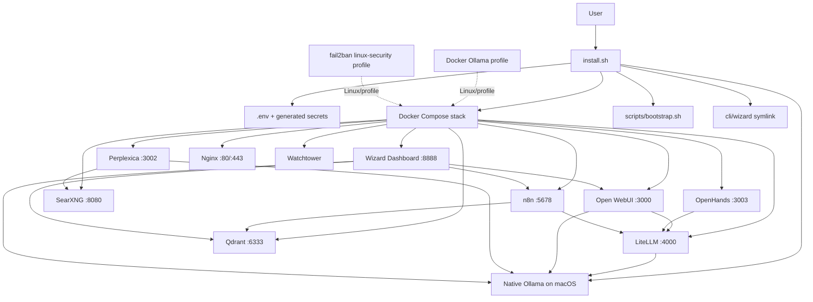

# Codex Baseline Review

Review date: 2026-05-05  
Scope: repository baseline review only. No application code changes recommended in this document.  
Position: protect the current installer unless a specific defect is isolated and tested.

## Executive Summary

`home-ai-elite` is currently a working installer-driven local AI stack. It installs and coordinates Docker services, native Ollama on macOS, RAM-tier model selection, secret generation, first-boot bootstrap, health checks, optional MCP setup, optional launchd setup, packaging scripts, and basic dashboard/CLI tooling.

The project is not yet a Merlin orchestration platform. It is best described as a full-stack local AI installer plus early Wizard/Merlin control surfaces. The main baseline risk is accidentally breaking the installer while trying to add orchestration, dashboard, profiles, or agent abstractions too quickly.

## Repo Map

| Path | Purpose |
|---|---|
| `install.sh` | Primary supported installer and baseline to protect |
| `docker-compose.yml` | Main service stack: dashboard, Open WebUI, LiteLLM, Qdrant, n8n, Perplexica, SearXNG, OpenHands, nginx, watchtower, optional Docker Ollama/fail2ban |
| `.env.example` | Template for secrets, model settings, ports, and optional provider keys |
| `configs/litellm/` | LiteLLM model routing config |
| `configs/perplexica/` | Perplexica local model/search config |
| `configs/searxng/` | SearXNG private search config |
| `configs/nginx/` | Local TLS reverse proxy config |
| `configs/fail2ban/` | Linux security profile config |
| `scripts/` | Operational scripts: bootstrap, status, healthcheck, update, upgrade, model add, backup, restart, stop, uninstall |
| `cli/wizard` | CLI wrapper for stack control, model status, swarm/memory calls, backup, debug, logs |
| `dashboard/index.html` | Static Wizard dashboard and early chat/status UI |
| `n8n-workflows/` | Starter routing/swarm/memory workflows |
| `backup/` | Separate backup/restore scripts, currently needing alignment |
| `launchd/` | macOS auto-start and backup LaunchAgents |
| `pkg/` | macOS package builder and installer scripts |
| `mcp/` | MCP setup and Codex config examples |
| `tests/` | End-to-end smoke test and test notes |
| `docs/` | Existing installer, model, failure, firmware, swarm, and architecture notes |

## Installer Flow Summary

`install.sh` is the main entry point.

1. Parses `--non-interactive`, `--yes`, `--skip-model-pulls`, and matching environment variables.
2. Creates install log at `~/.wizard/install.log`.
3. Registers an error trap that writes a local failure report.
4. Detects OS, currently macOS or Linux only.
5. Checks macOS version when on Darwin.
6. Detects RAM and selects model tier:
   - low: 8-15 GB
   - base: 16-23 GB
   - mid: 24-47 GB
   - high: 48+ GB
7. Checks disk space.
8. Finds Docker CLI, including Docker Desktop's bundled CLI path on macOS.
9. Waits for Docker Desktop/engine and can open Docker Desktop on macOS.
10. Installs dependencies:
    - macOS: Homebrew if missing, then `git`, `curl`, `jq`, `python3`
    - Linux: apt packages for `git`, `curl`, `jq`, `python3`
11. Installs/starts native Ollama on macOS.
12. Creates `.env` from `.env.example` if missing.
13. Sets `.env` to `600`.
14. Patches macOS runtime settings for native Ollama routing.
15. Rotates internal secrets:
    - `WEBUI_SECRET_KEY`
    - `LITELLM_MASTER_KEY`
    - `N8N_PASSWORD`
    - `N8N_ENCRYPTION_KEY`
    - `SEARXNG_SECRET_KEY`
16. Optionally prompts for cloud/API keys:
    - `OPENAI_API_KEY`
    - `ANTHROPIC_API_KEY`
    - `PERPLEXITY_API_KEY`
    - `GITHUB_TOKEN`
17. Verifies required Perplexica and LiteLLM config files exist.
18. Generates local nginx TLS certs if needed.
19. Selects and pulls RAM-tier Ollama models unless skipped.
20. Writes model/runtime values into `.env`.
21. Pulls Docker images.
22. Removes stale named containers before Compose up.
23. Starts Compose:
    - macOS skips Docker Ollama and uses native Ollama
    - Linux enables `docker-ollama` and `linux-security` profiles
24. Waits for service readiness.
25. Runs `scripts/bootstrap.sh` once unless `.wizard-bootstrapped` exists.
26. Installs `wizard` CLI symlink in `/usr/local/bin`.
27. Optionally runs MCP install.
28. Optionally installs launchd agents.
29. Runs a security checklist for `.env`, secrets, and `.gitignore`.
30. Prints service URLs and first steps.

## Component Inventory

### Runtime Services

| Component | Source | Default role |
|---|---|---|
| Native Ollama | host install on macOS | Local model runtime |
| Docker Ollama | Compose profile `docker-ollama` | Linux/local model runtime |
| Open WebUI | Compose | Primary chat UI |
| LiteLLM | Compose | Model gateway and compatibility layer |
| Qdrant | Compose | Vector memory store |
| n8n | Compose | Workflow automation and early routing |
| SearXNG | Compose | Private web search |
| Perplexica backend/frontend | Compose | Perplexity-style search UI |
| OpenHands | Compose | Coding/agent UI with Docker socket access |
| Dashboard | Compose nginx static site | Wizard status/control surface |
| nginx | Compose | Optional local TLS reverse proxy |
| watchtower | Compose | Container update automation |
| fail2ban | Compose profile `linux-security` | Linux brute-force mitigation |

### Scripts and Apps

| File | Role |
|---|---|
| `scripts/bootstrap.sh` | Starts stack, creates `home_ai_memory`, imports workflows if API key exists, checks models |
| `scripts/init-qdrant.sh` | Creates multiple Qdrant collections, currently not fully aligned with bootstrap |
| `scripts/import-n8n-workflows.sh` | Imports workflows through n8n REST API if `N8N_API_KEY` exists |
| `scripts/status.sh` | Service health display |
| `scripts/healthcheck.sh` | HTTP health checks and optional webhook ping |
| `scripts/update.sh` | Pulls images and restarts services |
| `scripts/upgrade.sh` | Git pull, backup, image pull, health check, rollback |
| `scripts/add-model.sh` | Pulls Ollama models, now macOS native-aware |
| `backup/backup.sh` | Separate backup script, currently stale paths/collections |
| `backup/restore.sh` | Separate restore script, currently stale collections |
| `cli/wizard` | CLI for stack, brain, swarm, memory, backup, debug |
| `pkg/build-pkg.sh` | macOS package builder |
| `pkg/scripts/preinstall` | macOS package preflight |
| `pkg/scripts/postinstall` | macOS package postinstall |
| `launchd/install-launchd.sh` | Installs LaunchAgents |

### Models

Installer RAM-tier models:

| Tier | Models pulled by `install.sh` unless skipped |
|---|---|
| low | `nomic-embed-text`, `mistral:7b`, `qwen2.5:7b` |
| base | `nomic-embed-text`, `qwen2.5:7b`, `qwen2.5-coder:7b`, `deepseek-r1:7b` |
| mid | `nomic-embed-text`, `qwen2.5:32b`, `qwen2.5-coder:14b`, `deepseek-r1:14b` |
| high | `nomic-embed-text`, `llama3.3:70b`, `qwen2.5:32b`, `deepseek-r1:32b` |

Other model manifest:

- `configs/models/models.json` lists older/different model names such as `llama3.2`, `mistral`, `deepseek-coder:6.7b`, `llama3.1:8b`, `llava`, `codellama:13b`, and `llama3.1:32b`.
- This manifest is not currently the source of truth for `install.sh`.

## Current Architecture Diagram

## What Is Already Working

- Installer has clear preflight flow and error reporting.
- macOS native Ollama path is implemented.
- Docker Desktop CLI discovery is implemented in several scripts.
- Internal secrets are generated and `.env` permissions are restricted.
- Cloud/API keys are optional and are not required for local mode.
- Docker Ollama and fail2ban are profile-gated.
- Service ports are now bound to localhost by default in Compose.
- LiteLLM provides a model routing foundation.
- Dashboard exists and can show service/model status.
- `wizard` CLI provides useful management/debug affordances.
- Tests exist for basic running service smoke checks.
- Package, launchd, MCP, backup, restore, and upgrade scaffolding exists.

## Fragile or Unclear Areas

- Full-stack startup is still effectively the installer default.
- n8n workflow import is not truly automatic because it depends on `N8N_API_KEY`.
- Memory collection names are inconsistent:
  - bootstrap: `home_ai_memory`
  - init script: `openwebui`, `perplexica`, `n8n_memory`, `documents`
  - CLI/backup: `conversations`, `documents`, `swarm_memory`
- `configs/models/models.json` does not match installer model tiers.
- `wizard start` uses raw `docker compose up -d`, not a profile-aware/core-first start.
- OpenHands mounts `/var/run/docker.sock`, which is high-risk and should be optional.
- Watchtower can change running images; this conflicts with strict release reproducibility.
- `scripts/upgrade.sh` uses `eval` in its helper and performs git operations; keep it isolated and tested before expanding.
- Dashboard is static and calls local services directly from the browser; it does not have a backend policy layer.
- Package postinstall launches the non-interactive installer in the background and installs launchd agents; failures may be hard for non-technical users to see.
- Some docs still describe old assumptions, including stale memory and port references.

## Installer Assumptions

### Hardware

- Minimum RAM: 8 GB.
- Low disk warning threshold: 30 GB in `install.sh`; package preinstall uses 20 GB.
- macOS 14+ recommended by `install.sh`; package preinstall allows macOS 13+.
- Apple Silicon performance assumes native Ollama with Metal.

### Dependencies

- Docker Desktop is required on macOS.
- Homebrew may be installed by the script if missing.
- `git`, `curl`, `jq`, `python3`, `openssl`, Docker Compose, and Ollama are expected.
- Linux path assumes apt-based systems.

### Ports

Default service ports:

- Dashboard: 8888
- Open WebUI: 3000
- Perplexica backend/frontend: 3001/3002
- OpenHands: 3003
- LiteLLM: 4000
- n8n: 5678
- Qdrant: 6333
- SearXNG: 8080
- Ollama: 11434
- nginx: 80/443

### Folders and Permissions

- Repo root is the stack directory.
- `.env` is expected at repo root and set to `600`.
- Logs go to `~/.wizard/install.log`.
- Wizard CLI is symlinked to `/usr/local/bin/wizard`, possibly requiring sudo.
- Package install stages to `/usr/local/home-ai-elite`, then copies to `~/home-ai-elite`.
- OpenHands writes to `~/.openhands-state`.

### Network Access

- Installer may download Homebrew, brew packages, Ollama, Ollama models, Docker images, MCP packages, and GitHub updates.
- Cloud APIs are optional and only configured when keys are supplied.
- Dashboard/browser talks to localhost services.

## Main Entry Points

- Installer: `install.sh`
- Compose stack: `docker-compose.yml`
- Bootstrap: `scripts/bootstrap.sh`
- CLI: `cli/wizard`
- Dashboard: `dashboard/index.html`
- Health/smoke tests: `scripts/status.sh`, `scripts/healthcheck.sh`, `tests/e2e-test.sh`
- Upgrade: `scripts/upgrade.sh`
- Package: `pkg/build-pkg.sh`, `pkg/scripts/preinstall`, `pkg/scripts/postinstall`

## Risks to Working Installer

1. Replacing installer flow instead of wrapping it with profiles.
2. Changing Compose service names or container names without updating stale-container removal, CLI status, tests, and launchd.
3. Changing model names without updating LiteLLM config, installer tiers, dashboard model list, and docs.
4. Changing ports without updating README, dashboard, tests, nginx, scripts, and workflows.
5. Enabling cloud providers by default.
6. Making OpenHands, n8n, Perplexica, or SearXNG required for core install.
7. Adding a new backend service before tests can distinguish core/search/automation/coding failures.
8. Modifying `.env` semantics without preserving secret rotation and permission checks.
9. Expanding `wizard` CLI command behavior without tests.
10. Allowing package/launchd install to auto-start a heavier stack than the user chose.

## Do Not Break List

- `bash install.sh`
- `bash install.sh --non-interactive --skip-model-pulls`
- macOS native Ollama path
- Linux Docker Ollama profile path
- `.env` generation and secret rotation
- `.env` chmod `600`
- localhost-only port bindings
- optional cloud key behavior
- `scripts/bootstrap.sh`
- `scripts/status.sh`
- `tests/e2e-test.sh`
- `wizard brain status/start/stop`
- Docker Desktop CLI discovery on macOS
- first-run failure report generation
- no cloud calls by default
- no large model downloads without user choice or explicit installer tier behavior
