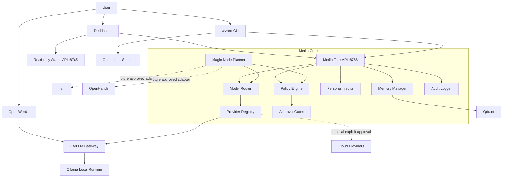
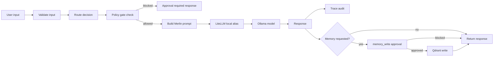

# Merlin Architecture Spec

Last updated: 2026-05-06

## Target Architecture

Merlin is a secure orchestration layer around existing local AI tools.

It should not replace Ollama, LiteLLM, Open WebUI, Qdrant, n8n, or OpenHands. It should wrap them with routing, policy, approvals, status, memory controls, and audit logs.

## System Diagram

## Data Flow

## Component Specs

| Component | Inputs | Outputs | Responsibilities | MVP Tests |
| --- | --- | --- | --- | --- |
| Merlin Core | Task request, session, config | Response, route, trace | Validate input, orchestrate router/policy/persona/model/memory | Endpoint happy/degraded/403 tests |
| Model Router | User input, routes, hardware/provider state | Route decision | Classify task, choose route/model alias, hash input logs | Route tests for all route IDs |
| Provider Registry | Config, env key presence, health | Provider availability | Track local vs optional cloud providers | Cloud disabled by default |
| Memory Manager | Text, metadata, collection | Point IDs, search results | Embed locally, validate dimensions, write/search/delete | Dimension/degraded tests |
| Agent Controller | Plan step, approval | Adapter call or blocked result | Future adapter boundary for n8n/OpenHands/tools | v1 plan-only no execution |
| Policy Engine | Action gate, policy config | Allow/block | Fail closed, require approval for risky actions | All gates enforced |
| Audit Logger | Route/policy/action events | Redacted logs | No raw input/secrets, trace outcomes | Redaction tests |
| Magic Mode | Goal, route registry | Plan steps | Plan first, no v1 execution | Plan-only smoke tests |
| Dashboard | Status APIs | UI state | Explain health, local mode, approvals, memory | UI smoke/no secret display |
| Hardware Tier Engine | RAM/OS/profile | Tier, warnings | Recommend safe defaults | 8GB low tier tests |

## Dependency Policy

- Direct dependencies are allowed only when the repo cannot reasonably wrap an existing service.
- Adapter integrations are preferred for external systems.
- Future integrations should be optional until they prove value.

| Tool/Pattern | v1 Treatment |
| --- | --- |
| Ollama | Required local runtime wrapper |
| LiteLLM | Existing gateway wrapper |
| Open WebUI | Existing UI, not replaced |
| Qdrant | Existing memory store |
| n8n | Optional adapter, no default execution |
| OpenHands | Optional high-risk adapter, no v1 execution |
| LangChain/LangGraph | Architecture reference only |
| OpenAI Agents SDK | Architecture reference only |
| MCP | Tool interface reference only |
| Chroma/SQLite memory | Reference alternatives, not added |
