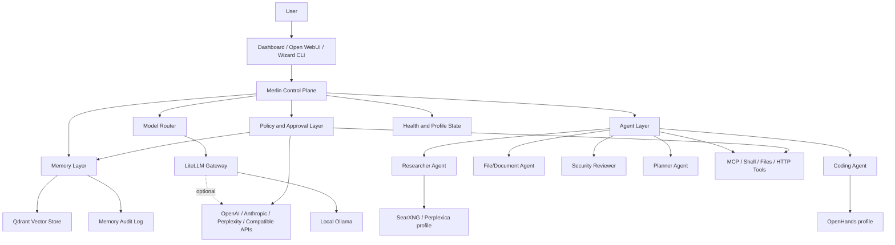
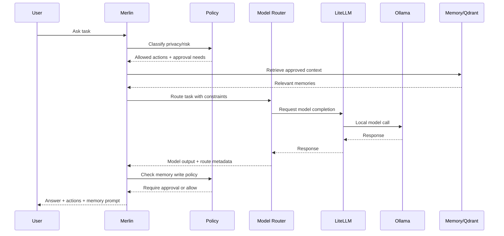

# Merlin Brain Specification

## Merlin v1 Scope

Merlin v1 is a local-first orchestration layer over the existing Home AI Elite stack. It should not replace the installer, Ollama, LiteLLM, Open WebUI, or Qdrant. It should provide a stable control model for routing, memory, agent actions, Magic Mode, and security policy.

Merlin v1 must:

- Run locally by default.
- Use LiteLLM as the model gateway.
- Use Qdrant as the memory store.
- Use Open WebUI as the primary chat UI.
- Keep n8n/OpenHands/Search optional.
- Require approval for risky actions.
- Avoid cloud/API calls unless explicitly enabled.
- Be profile-aware and hardware-tier-aware.

## Persona And Operating Principles

Merlin should feel like a local AI engineering team, not a single locked-in chatbot. The declarative seed for that behavior lives in `config/merlin/persona.yaml`.

The persona is intentionally non-executable in v1 infrastructure work. It defines the product stance for future Merlin/Magic Mode routing:

- local-first by default
- cloud disabled unless explicitly enabled
- memory writes require approval
- risky shell, file, git, service, network, and model-download actions require approval
- protect the working installer
- prefer small, reviewable engineering steps

Team modes in the persona map to future agent roles: architect, AI engineer, software engineer, security reviewer, product designer, and operator.

## Architecture Diagram



## Data Flow Diagram



## Model Router Design

The router should choose a backend using:

- task type: general, code, research, sensitive, summarization, embedding
- privacy level: sensitive, local-only, cloud-allowed
- hardware tier: low, base, mid, high, server
- latency target: fast, balanced, best
- cost preference: local-only, low-cost, best-available
- offline/online mode
- user model preference
- current model availability

Recommended v1 implementation:

- Keep LiteLLM as provider gateway.
- Add a Merlin route decision object before LiteLLM calls.
- Store route metadata in logs.
- Keep cloud providers disabled unless `.env` has keys and user enables online mode.
- Use `config/merlin/routes.yaml` as the declarative route map for Magic Mode task classes.

Example route decision:

```yaml
task_type: code
privacy: local_only
hardware_tier: base
online_mode: false
selected_model: ollama/qwen2.5-coder:7b
provider: ollama
fallbacks:
  - ollama/qwen2.5:7b
approval_required: false
```

Magic Mode route classes:

| Route | Agent | Required profile | Default risk | Required approvals |
|---|---|---|---|---|
| `general` | planner | core | low | none |
| `search` | researcher | search | high | service start, external network |
| `code` | coding | coding | critical | service start, file read/write, shell, git, OpenHands task |
| `automation` | operator | automation | high | service start, API key use, external network, memory write |
| `memory` | memory | core | medium | memory write, file read, file delete |

Routes must emit trace fields for route id, task type, selected agent, required profile, selected model alias, privacy mode, online mode, approval gates, and decision reason.

## Memory Design

Merlin memory must be explicit and auditable. It should not silently learn every prompt.

Memory classes:

- session memory: short-lived conversation context
- user-approved memory: facts/preferences explicitly approved by user
- document memory: indexed user documents
- tool-result memory: approved outputs from tools
- system memory: installation/configuration facts

Required v1 behavior:

- Memory writes require approval unless explicitly configured otherwise.
- Memory entries have source, timestamp, type, owner, and deletion status.
- User can delete memories.
- Dashboard can show recent memory writes.
- RAG retrieval is local by default.

Suggested collection model:

| Collection | Purpose | Default TTL |
|---|---|---|
| `merlin_session` | short-lived session context | hours/days |
| `merlin_user` | approved user facts/preferences | none |
| `merlin_documents` | document chunks | until deleted |
| `merlin_tools` | approved tool results | configurable |
| `merlin_audit` | memory write metadata | append-only/log file or DB |

## Agent Design

Agents are roles, not necessarily separate processes in v1.

| Agent | Purpose | Tools |
|---|---|---|
| Planner | Break goals into steps | none by default |
| Researcher | Search and synthesize | search profile, browser/search tools |
| Coding | Code reasoning and repo tasks | OpenHands/profile, file tools with approval |
| File/Document | Read/index docs | filesystem/doc parser with scoped access |
| Security Reviewer | Review risk and policy | logs/config/files read-only |
| Personal Assistant | Future companion behavior | calendar/webhooks only after explicit setup |

Agent actions should pass through the policy layer before accessing files, shell, network, memory writes, or cloud APIs.

## Magic Mode Design

Magic Mode is computer-orchestration mode. It must be controlled, visible, and interruptible.

Magic Mode v1 capabilities:

1. Accept a user goal.
2. Draft a plan.
3. Show steps and required tools.
4. Ask for approval before risky steps.
5. Execute approved steps.
6. Log every action.
7. Allow pause/stop.
8. Summarize results and changed files/settings.

Risky actions requiring approval:

- shell command execution
- file writes/deletes
- git operations
- network calls outside localhost
- API/cloud model use
- memory writes
- starting/stopping heavy services
- OpenHands task execution

Magic Mode should not be enabled by default on low-tier installs.

## Security Policy Design

Policy dimensions:

| Area | Default | Approval required |
|---|---|---|
| Network | localhost only | external network/API calls |
| Files | no arbitrary access | read/write outside allowed scopes |
| Shell | disabled for agents | all shell commands |
| Cloud APIs | disabled | every provider enablement |
| Memory writes | approval required | user can allow auto-save later |
| Code execution | disabled | OpenHands/coding profile approval |
| Service control | status only | start/stop/restart heavy profiles |

Policy output should be machine-readable:

```yaml
action: file_write
scope: repo
risk: high
requires_approval: true
reason: "Modifies repository files"
```

The declarative v1 policy seed lives in `config/merlin/policy.yaml`. It is non-executable until the Merlin control plane exists, but it establishes conservative defaults for Magic Mode, route classes, approval gates, allowed local scopes, audit logging, and low-memory behavior.

The policy must keep these defaults until runtime approval handling is implemented:

- Magic Mode disabled by default.
- Online/cloud fallback disabled by default.
- Shell and file writes disabled for agents by default.
- Memory auto-write disabled by default.
- OpenHands tasks treated as critical risk.
- External network, cloud model calls, API key use, model downloads, git operations, file writes/deletes, shell commands, memory writes, and optional service control require approval.

## API/Provider Abstraction Design

Provider config should support:

- provider name
- type: local, openai-compatible, anthropic-compatible, search, embedding
- base URL
- API key environment variable name
- enabled flag
- privacy class
- cost class
- allowed task types

Example:

```yaml
providers:
  ollama:
    type: local
    base_url: http://localhost:11434
    enabled: true
    privacy: local
  openai:
    type: openai_compatible
    api_key_env: OPENAI_API_KEY
    enabled: false
    privacy: external
```

## Configuration Structure

Recommended future files:

```text
config/merlin/
  profiles.yaml
  hardware-tiers.yaml
  providers.yaml
  models.yaml
  memory.yaml
  policy.yaml
  agents.yaml
```

Do not introduce all files at once. Start with `profiles.yaml` or `hardware-tiers.yaml`, then add others when implementation needs them.

## Merlin v1 Non-Goals

- Replacing the installer.
- Replacing Open WebUI.
- Replacing LiteLLM.
- Replacing Qdrant.
- Building a new full agent framework before core is stable.
- Automatic cloud fallback.
- Silent memory learning.
- Autonomous shell/file/network actions.
