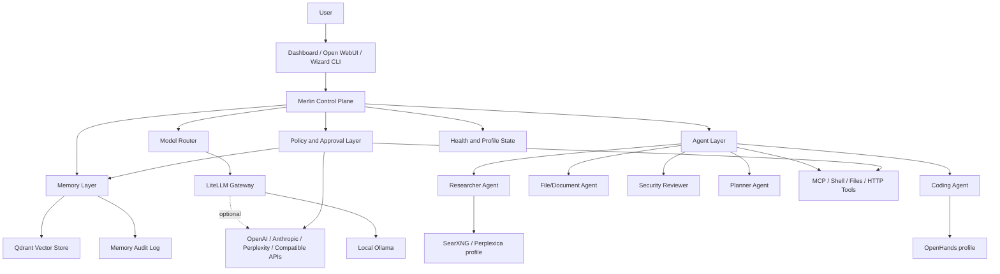
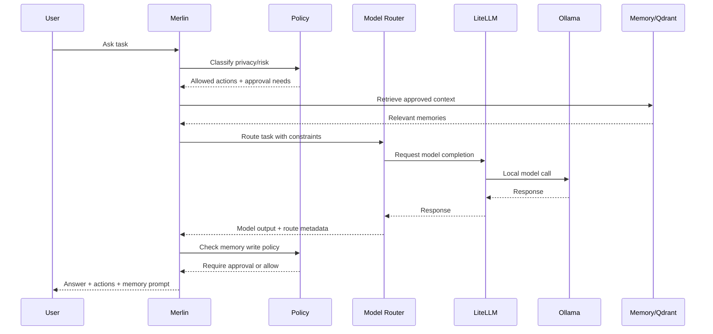

# Merlin Brain Specification

## Merlin v1 Scope

Merlin v1 is a local-first orchestration layer over the existing Home AI Elite stack. It should not replace the installer, Ollama, LiteLLM, Open WebUI, or Qdrant. It should provide a stable control model for routing, memory, agent actions, Magic Mode, and security policy.

Merlin v1 must:

- Run locally by default.
- Use LiteLLM as the model gateway.
- Use Qdrant as the memory store.
- Use Open WebUI as the primary chat UI.
- Keep n8n/OpenHands/Search optional.
- Require approval for risky actions.
- Avoid cloud/API calls unless explicitly enabled.
- Be profile-aware and hardware-tier-aware.

## Orchestration Decision

Merlin should use a hybrid orchestration model. The core control plane should be lightweight and local: it reads profile/hardware state, evaluates policy, selects routes, requests approvals, writes route traces, calls LiteLLM for model work, and accesses Qdrant only after memory policy allows it.

n8n is an optional workflow engine, not the mandatory Merlin brain. OpenHands is an optional high-risk coding executor. SearXNG/Perplexica are optional search tools. LangGraph, OpenAI Agents SDK-style patterns, and MCP are future integration options after approval gates and route traces exist.

The decision is captured in `config/merlin/orchestration.yaml`.

## Persona And Operating Principles

Merlin should feel like a local AI engineering team, not a single locked-in chatbot. The declarative seed for that behavior lives in `config/merlin/persona.yaml`.

The persona is intentionally non-executable in v1 infrastructure work. It defines the product stance for future Merlin/Magic Mode routing:

- local-first by default
- cloud disabled unless explicitly enabled
- memory writes require approval
- risky shell, file, git, service, network, and model-download actions require approval
- protect the working installer
- prefer small, reviewable engineering steps

Merlin's guardian ethos is also defined in the persona seed. It frames Merlin as a watcher for the user's local AI home: protective, truthful, compassionate, and guided by love, humility, service, and protection of the vulnerable. Merlin must not lie, fabricate capability, hide uncertainty, or claim completed work that is not complete. If Merlin cannot do something, it should say so plainly, explain the blocker, and offer the safest path to improve or try again. This is a product ethic, not permission for unsafe autonomy. The persona explicitly rejects claims of omniscience, divine authority, coercion, or any use of faith language to bypass consent, evidence, safety policy, or user control.

Team modes in the persona map to future agent roles: architect, AI engineer, software engineer, security reviewer, product designer, and operator.

## Architecture Diagram



## Data Flow Diagram



## Model Router Design

The router should choose a backend using:

- task type: general, code, research, sensitive, summarization, embedding
- privacy level: sensitive, local-only, cloud-allowed
- hardware tier: low, base, mid, high, server
- latency target: fast, balanced, best
- cost preference: local-only, low-cost, best-available
- offline/online mode
- user model preference
- current model availability

Recommended v1 implementation:

- Keep LiteLLM as provider gateway.
- Add a Merlin route decision object before LiteLLM calls.
- Store route metadata in logs.
- Keep cloud providers disabled unless `.env` has keys and user enables online mode.
- Use `config/merlin/routes.yaml` as the declarative route map for Magic Mode task classes.

Example route decision:

```yaml
task_type: code
privacy: local_only
hardware_tier: base
online_mode: false
selected_model: ollama/qwen2.5-coder:7b
provider: ollama
fallbacks:
  - ollama/qwen2.5:7b
approval_required: false
```

Magic Mode route classes:

| Route | Agent | Required profile | Default risk | Required approvals |
|---|---|---|---|---|
| `general` | planner | core | low | none |
| `search` | researcher | search | high | service start, external network |
| `code` | coding | coding | critical | service start, file read/write, shell, git, OpenHands task |
| `automation` | operator | automation | high | service start, API key use, external network, memory write |
| `memory` | memory | core | medium | memory write, file read, file delete |

Routes must emit trace fields for route id, task type, selected agent, required profile, selected model alias, privacy mode, online mode, approval gates, and decision reason.

## Route Trace Design

The trace schema lives in `config/merlin/trace.yaml`. Future Merlin runtime code must write route decisions as local append-only JSONL before any tool/model side effect. Trace records must redact secrets before writing and include approval state.

Minimum route trace fields:

- trace id and timestamp
- hashed user goal or short non-sensitive summary
- route id and task type
- selected agent, required profile, active profile, hardware tier
- privacy mode, online mode, cloud allowed flag
- selected model alias and provider
- approval gates, approval status, policy decision, decision reason
- redaction flag

Route traces must never log raw API keys, auth headers, cookies, private keys, full documents, or raw sensitive prompts.

## Read-Only Dry-Run Control Plane

The first runtime control-plane slice is `scripts/merlin-dry-run.sh`, exposed through `wizard merlin dry-run "goal"`. It reads the declarative route, policy, and trace contracts and prints a route decision preview.

Dry-run behavior:

- classify the user goal into general, search, code, automation, or memory
- select the route, agent, required profile, and preferred local model alias
- detect the active install profile and hardware tier
- keep online mode and cloud access disabled by default
- show approval gates and pending approval state for risky routes
- report trace-compatible fields without writing a trace log yet
- perform no service starts, model calls, memory writes, downloads, API calls, file writes, shell actions, or tool execution

This keeps the product path aligned with the installer: Merlin can reason about the existing stack before it is allowed to operate the stack.

Dry-run can also append an audit record with `--write-trace`. This writes one redacted JSONL route decision to the trace log from `config/merlin/trace.yaml`, or to `--trace-log <path>` for tests. Trace writes store the hashed user goal and route metadata only; they must not store raw prompts, documents, API keys, auth headers, or tool outputs. Trace writing is intentionally separate from model calls and tool execution.

Risky dry-run routes also produce a non-executing approval request object. The request includes an approval id, route id, pending status, required gates, and an explicit `execution_allowed: false` field. This is the approval foundation for Magic Mode: Merlin can now explain what approval would be needed before any service start, shell command, file write, network call, memory write, model download, or OpenHands task is implemented.

When dry-run tracing is enabled, pending approval requests are also appended to `logs/merlin-approvals.jsonl`. Approval records are redacted local JSONL audit entries. They include approval id, timestamp, hashed user goal, route id, task type, gates, policy decision, pending status, and `execution_allowed: false`. They must not include raw prompts, secrets, document bodies, tool outputs, or approval message bodies. Approval persistence does not approve, deny, or execute the action; it only records the request for later review.

Pending approval requests can be reviewed with `wizard merlin approvals list`. The command is read-only and displays approval id, status, execution flag, route, task type, gates, policy decision, and hashed user goal. It does not approve, deny, execute, start services, call models, or expose raw prompt text.

Approval decisions can be recorded with `wizard merlin approvals approve <id>` and `wizard merlin approvals deny <id>`. These commands append a decision record to the local approval JSONL log and update the latest-state list view. They still set `execution_allowed: false` and must not execute actions, start services, call models, write memory, or expose raw prompt text. Approval records are evidence for a later execution boundary, not authority by themselves.

`wizard merlin status` provides a read-only control-plane summary for the active profile, hardware tier, local/cloud mode, trace log path/count, approval log counts, and core service reachability. It is intentionally observational: it does not start missing services, approve requests, call models, write memory, or execute tools.

`wizard merlin execute plan|execute --action merlin_status` is the v0 execution boundary. It supports only the harmless read-only `merlin_status` action, separates plan mode from execute mode, and appends a redacted local JSONL execution audit record on execute. It refuses shell, file, git, network, cloud, API key, memory write, service control, model download, and OpenHands actions even if an approval id is already approved. Future adapters must be added one at a time with allowlists, approval checks, audit logging, and denial tests.

`wizard merlin magic plan "goal"` is the first Magic Mode runner. It calls the existing route dry-run, converts the route decision into visible steps, shows pause/stop support, marks every step `execution_allowed: false`, and can append a redacted plan record to `logs/merlin-magic-plans.jsonl`. It may create route trace and pending approval audit records when `--write-plan` is used, but it must not execute steps, call models, start services, write memory, run tools, use cloud, or log the raw user goal.

`wizard merlin memory plan|simulate|write --memory-type <type> --text <text>` is the approved memory-write boundary. Plan mode writes nothing. Simulate mode requires an approved approval id whose latest approval record includes the `memory_write` gate and writes only a redacted JSONL audit record. Write mode also requires that same approval gate, requires the target canonical Qdrant collection to already exist, calls only the local Ollama embedding endpoint, and then upserts the approved memory into local Qdrant. Audit logs must never store raw memory text; the Qdrant payload may store the raw approved text because retrieval memory needs it.

## Memory Design

Merlin memory must be explicit and auditable. It should not silently learn every prompt.

Memory classes:

- session memory: short-lived conversation context
- user-approved memory: facts/preferences explicitly approved by user
- document memory: indexed user documents
- tool-result memory: approved outputs from tools
- system memory: installation/configuration facts

Required v1 behavior:

- Memory writes require approval unless explicitly configured otherwise.
- Memory entries have source, timestamp, type, owner, and deletion status.
- Simulator records are audit-only and are not retrieval memory.
- Real local memory writes require canonical Qdrant collections, local embeddings, redacted audit logging, and fail-closed denial on missing dependencies.
- User can delete memories.
- Dashboard can show recent memory writes.
- RAG retrieval is local by default.

Suggested collection model:

| Collection | Purpose | Default TTL |
|---|---|---|
| `merlin_session` | short-lived session context | hours/days |
| `merlin_user` | approved user facts/preferences | none |
| `merlin_documents` | document chunks | until deleted |
| `merlin_tools` | approved tool results | configurable |
| `merlin_audit` | memory write metadata | append-only/log file or DB |

## Agent Design

Agents are roles, not necessarily separate processes in v1.

| Agent | Purpose | Tools |
|---|---|---|
| Planner | Break goals into steps | none by default |
| Researcher | Search and synthesize | search profile, browser/search tools |
| Coding | Code reasoning and repo tasks | OpenHands/profile, file tools with approval |
| File/Document | Read/index docs | filesystem/doc parser with scoped access |
| Security Reviewer | Review risk and policy | logs/config/files read-only |
| Personal Assistant | Future companion behavior | calendar/webhooks only after explicit setup |

Agent actions should pass through the policy layer before accessing files, shell, network, memory writes, or cloud APIs.

## Magic Mode Design

Magic Mode is computer-orchestration mode. It must be controlled, visible, and interruptible.

Magic Mode v1 capabilities:

1. Accept a user goal.
2. Draft a plan.
3. Show steps and required tools.
4. Ask for approval before risky steps.
5. Log every planned step.
6. Execute approved steps only after a scoped adapter exists.
7. Allow pause/stop.
8. Summarize results and changed files/settings.

Risky actions requiring approval:

- shell command execution
- file writes/deletes
- git operations
- network calls outside localhost
- API/cloud model use
- memory writes
- starting/stopping heavy services
- OpenHands task execution

Magic Mode should not be enabled by default on low-tier installs.

## Security Policy Design

Policy dimensions:

| Area | Default | Approval required |
|---|---|---|
| Network | localhost only | external network/API calls |
| Files | no arbitrary access | read/write outside allowed scopes |
| Shell | disabled for agents | all shell commands |
| Cloud APIs | disabled | every provider enablement |
| Memory writes | approval required | user can allow auto-save later |
| Code execution | disabled | OpenHands/coding profile approval |
| Service control | status only | start/stop/restart heavy profiles |

Policy output should be machine-readable:

```yaml
action: file_write
scope: repo
risk: high
requires_approval: true
reason: "Modifies repository files"
```

The declarative v1 policy seed lives in `config/merlin/policy.yaml`. It is non-executable until the Merlin control plane exists, but it establishes conservative defaults for Magic Mode, route classes, approval gates, allowed local scopes, audit logging, and low-memory behavior.

The policy must keep these defaults until runtime approval handling is implemented:

- Magic Mode disabled by default.
- Online/cloud fallback disabled by default.
- Shell and file writes disabled for agents by default.
- Memory auto-write disabled by default.
- OpenHands tasks treated as critical risk.
- External network, cloud model calls, API key use, model downloads, git operations, file writes/deletes, shell commands, memory writes, and optional service control require approval.

## API/Provider Abstraction Design

Provider config should support:

- provider name
- type: local, openai-compatible, anthropic-compatible, search, embedding
- base URL
- API key environment variable name
- enabled flag
- privacy class
- cost class
- allowed task types

Example:

```yaml
providers:
  ollama:
    type: local
    base_url: http://localhost:11434
    enabled: true
    privacy: local
  openai:
    type: openai_compatible
    api_key_env: OPENAI_API_KEY
    enabled: false
    privacy: external
```

## Configuration Structure

Recommended future files:

```text
config/merlin/
  profiles.yaml
  hardware-tiers.yaml
  providers.yaml
  models.yaml
  memory.yaml
  policy.yaml
  agents.yaml
```

Do not introduce all files at once. Start with `profiles.yaml` or `hardware-tiers.yaml`, then add others when implementation needs them.

## Merlin v1 Non-Goals

- Replacing the installer.
- Replacing Open WebUI.
- Replacing LiteLLM.
- Replacing Qdrant.
- Building a new full agent framework before core is stable.
- Automatic cloud fallback.
- Silent memory learning.
- Autonomous shell/file/network actions.
