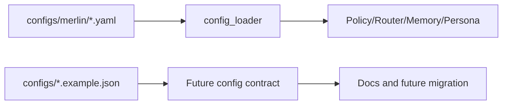

# Merlin Config Spec

Last updated: 2026-05-06

## Canonical Config Root

Runtime config belongs under `configs/`. The repo intentionally rejects a root-level legacy config directory. Example JSON files added for planning should stay under `configs/` unless the config-root smoke test and architecture decision are updated.

## Safe Defaults

The default Merlin config should be:

- `mode`: `local_only`
- external providers disabled
- memory writes approval-required
- agents supervised-only or disabled
- Magic Mode execution plan-only
- shell access approval-required
- file write access approval-required
- telemetry disabled
- dashboard localhost-only

## Top-Level Fields

| Field | Purpose | MVP Behavior |
| --- | --- | --- |
| `mode` | Privacy/connectivity mode | `local_only` |
| `hardware_tier` | Detected or user override tier | `auto` by default |
| `default_model` | Default local model alias | `qwen7b` or installed local alias |
| `providers` | Local/cloud provider registry | local enabled, cloud disabled |
| `memory` | Memory collections and approval | local Qdrant, approval required |
| `agents` | Agent permissions | supervised only, no background agents |
| `magic_mode` | Planning/execution settings | plan-only |
| `dashboard` | UI/server settings | localhost, safe status first |
| `security` | Action gates and data handling | fail closed |
| `logging` | Audit/traces | redacted, no raw input |
| `external_providers` | Optional cloud setup | disabled |

## Config Data Flow

## Migration Rule

Do not replace the existing YAML configs in v1. JSON examples are planning artifacts until an approved config migration exists.
