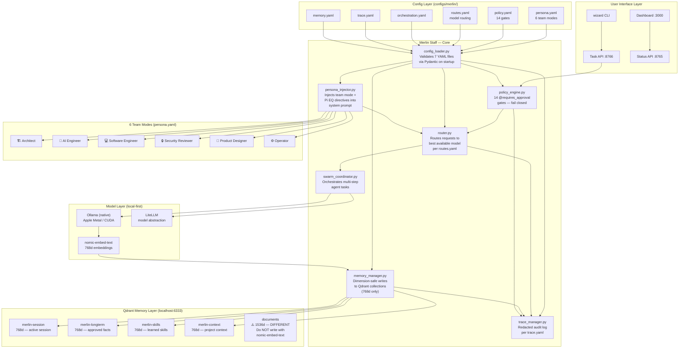

# Merlin Staff — Core

> **Status:** Active build target — Phase 2A (config loader) in progress  
> **Last updated:** 2026-05-06  
> **Canonical source:** `docs/MERLIN_STAFF_CORE.md`  
> **Update rule:** This file MUST be updated whenever a config file, policy gate, team mode, phase boundary, or Pi EQ behavior changes. No milestone is complete without a doc update.

---

## What Is Merlin Staff — Core?

Merlin Staff — Core is the runtime that activates the six AI team roles declared in `configs/merlin/persona.yaml`. It is the bridge between the YAML config layer and the Python execution layer. Before this component exists, the roles are aspirational. After it exists, Merlin dynamically routes every request to the right team member, enforces policy, manages memory safely, and carries session context forward the way Pi did — but locally, privately, and for free.

The name is intentional. The **Staff** is the team. The **Core** is the runtime. Together they are the living, breathing version of the architecture that has been designed for months.

---

## System Architecture Diagram



---

## The 6 Team Modes

Declared in `configs/merlin/persona.yaml`. Activated by `persona_injector.py` at request time based on intent classification.

| Mode | Role | When Activated | Key Behavior |
|---|---|---|---|
| 🏗️ **Architect** | System design, tradeoffs, direction | Design questions, `--mode architect` | Thinks in systems, proposes patterns, challenges assumptions |
| 🤖 **AI Engineer** | Model routing, embeddings, vector ops | ML/model tasks, memory ops | Optimizes for local inference, dimension safety, embedding quality |
| 💻 **Software Engineer** | Code, tests, CI | Implementation tasks | Writes production code, respects DO_NOT_BREAK.md |
| 🔒 **Security Reviewer** | Policy, threat model, audit | Security questions, pre-merge | Treats every action as potentially adversarial |
| 🎨 **Product Designer** | UX, dashboard, user flows | UI/UX tasks | Centers non-technical users, dashboard clarity |
| ⚙️ **Operator** | Install, services, infra | Ops/infra tasks | Laptop-safe defaults, profile separation, no breaking changes |

---

## The 14 Policy Gates

Declared in `configs/merlin/policy.yaml`. Enforced by `policy_engine.py` via `@requires_approval` decorator. Every gate fails **closed** — denial is the default, not the exception.

| # | Gate Name | What It Controls |
|---|---|---|
| 1 | `shell_command` | Any subprocess/shell execution |
| 2 | `file_read` | Reading files outside approved paths |
| 3 | `file_write` | Writing or creating files |
| 4 | `file_delete` | Deleting files |
| 5 | `git_operation` | Any git command (commit, push, branch) |
| 6 | `external_network` | Any outbound HTTP/HTTPS call |
| 7 | `cloud_model_call` | Calls to OpenAI, Anthropic, Gemini, etc. |
| 8 | `api_key_use` | Using any stored credential or token |
| 9 | `memory_write` | Writing to any Qdrant collection |
| 10 | `service_start` | Starting Docker services or system daemons |
| 11 | `service_stop` | Stopping services |
| 12 | `model_download` | Pulling models via Ollama or HuggingFace |
| 13 | `openhands_task` | Any OpenHands agent execution (Docker socket risk) |
| 14 | `magic_mode_execute` | Executing a Magic Mode plan step |

**Audit trail:** Every gate decision (approved or denied) is written to the redacted audit log via `trace_manager.py` per `configs/merlin/trace.yaml`.

---

## The Pi Emotional Intelligence Milestone

### What Pi Got Right

Pi (Inflection AI) achieved 1M daily users with 33-minute average sessions through one mechanism: the session felt personal. Two specific behaviors drove this:

1. **Follow-up questions** — Pi engaged back rather than just answering. The conversation continued.
2. **Within-session recall** — Context carried forward naturally. Earlier points were referenced later. It felt like a relationship, not a query loop.

### Where Pi Failed

| Dimension | Pi | Merlin |
|---|---|---|
| Memory persistence | Cloud-only, reset each session | Qdrant local, approved writes persist |
| Privacy | All data left the device | 100% local by default |
| Cost | Freemium/subscription | $0 after hardware |
| Autonomy | Passive — waited for the user | n8n automation, Magic Mode planned |
| Evolution | Stalled after Microsoft acquisition | Active build, CI-gated |

### Implementation (4 Lines, Not a Milestone)

The Pi behaviors are implemented entirely inside `persona_injector.py` reading `persona.yaml`. This is **not** a separate system — it is a directive in the system prompt template:

```yaml
# In persona.yaml — guardian_ethos section
pi_eq:
  follow_up: true          # Ask one deepening question per response when context warrants
  session_recall: true     # Reference earlier conversation points naturally
  warm_voice: true         # Guardian tone — helpful, protective, never cold
  max_follow_ups: 1        # Never ask more than one follow-up per turn
```

Session recall uses `merlin-session` (768d) in Qdrant. The `swarm_coordinator.py` already seeds this collection on session start. The Pi milestone is activated the moment `persona_injector.py` reads these flags and injects the directive.

---

## The Dimension Safety Rule

> ⚠️ **This is a silent data corruption risk. Read carefully.**

The `documents` Qdrant collection uses **1536 dimensions**. Every other Merlin collection (`merlin-session`, `merlin-longterm`, `merlin-skills`, `merlin-context`) uses **768 dimensions** (nomic-embed-text output).

If `memory_manager.py` writes to `documents` using `nomic-embed-text`, Qdrant will silently reject or corrupt the vector. There is no loud failure — the write appears to succeed but produces garbage search results.

**The fix, already in the plan:**
```python
# memory_manager.py — dimension validation on every write
COLLECTION_DIMS = {
    "merlin-session": 768,
    "merlin-longterm": 768,
    "merlin-skills": 768,
    "merlin-context": 768,
    "documents": 1536,  # Requires text-embedding-ada-002 or equivalent
}

def validate_dimension(collection: str, vector: list) -> None:
    expected = COLLECTION_DIMS.get(collection)
    if expected and len(vector) != expected:
        raise DimensionMismatchError(
            f"Collection '{collection}' expects {expected}d, got {len(vector)}d. "
            f"Do not write to 'documents' with nomic-embed-text."
        )
```

---

## Build Phases

### Phase 2A — Config Loader (Start Here)
- File: `merlin/config_loader.py`
- Validates all 7 YAML files via Pydantic on startup
- Hard stops with clear error messages if any contract is violated
- **Risk:** Zero. Read-only. No execution path touched.
- **Time:** ~1 day

### Phase 2B — Policy Engine
- File: `merlin/policy_engine.py`
- Implements `@requires_approval` for all 14 gates
- Wires to `policy.yaml` via config loader
- **Risk:** Low. Adds gates, removes nothing.

### Phase 2C — Router
- File: `merlin/router.py`
- Routes requests to model per `routes.yaml`
- Respects hardware tier, privacy mode, and fallback chain
- **Risk:** Medium. First execution path.

### Phase 2D — Memory Manager
- File: `merlin/memory_manager.py`
- Dimension-safe writes with `DimensionMismatchError`
- Wraps existing Qdrant adapter
- **Risk:** Low-medium. Write path but fail-closed.

### Phase 2E — Persona Injector (Pi EQ)
- File: `merlin/persona_injector.py`
- Reads `persona.yaml`, injects team mode + Pi EQ directives
- Activates the 6 staff modes and Pi follow-up/recall behavior
- **Risk:** Low. System prompt injection only.

---

## Key Files Reference

| File | Purpose |
|---|---|
| `configs/merlin/persona.yaml` | 6 team modes, Pi EQ directives, guardian ethos |
| `configs/merlin/policy.yaml` | 14 approval gates, execution rules |
| `configs/merlin/routes.yaml` | Model routing, fallback chains, hardware tiers |
| `configs/merlin/orchestration.yaml` | Swarm coordination, agent task routing |
| `configs/merlin/trace.yaml` | Audit log schema, redaction rules |
| `configs/merlin/memory.yaml` | Collection names, dimension map, write policy |
| `merlin/config_loader.py` | Phase 2A — Pydantic validation of all 7 YAMLs |
| `merlin/policy_engine.py` | Phase 2B — 14 gate enforcement |
| `merlin/router.py` | Phase 2C — model routing |
| `merlin/memory_manager.py` | Phase 2D — dimension-safe Qdrant writes |
| `merlin/persona_injector.py` | Phase 2E — team mode + Pi EQ injection |
| `merlin/trace_manager.py` | Redacted audit logging |
| `merlin/swarm_coordinator.py` | Multi-step agent orchestration |
| `merlin/task_endpoint.py` | FastAPI task API :8766 |
| `scripts/merlin-status-api.py` | Read-only status API :8765 |
| `docs/MASTER_PROMPT.md` | Codex session north star — always current |
| `docs/MASTER_CONTEXT.md` | Full project context |
| `ROADMAP.md` | Phase-by-phase milestone tracker |

---

## Documentation Update Rule

This file is a **living document**. The following changes REQUIRE an update to `docs/MERLIN_STAFF_CORE.md` before a milestone is called complete:

- Any new or removed team mode in `persona.yaml`
- Any new or removed policy gate in `policy.yaml`
- Any change to the Qdrant collection dimension map
- Any new build phase or phase boundary change
- Any change to the Pi EQ behavior flags
- Any new file added to the Key Files Reference table
- Any architecture topology change (new service, new port, new data flow)

This rule is enforced by `docs/MASTER_PROMPT.md` Rule 11.
