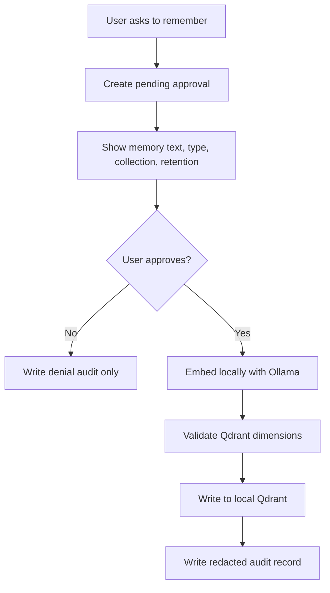

# Privacy And Memory Model

Last updated: 2026-05-06

## Meaning Of Learning

In Home AI Elite, "learning" means:

- User-approved memory.
- Approved document recall.
- Approved preferences.
- Approved tool results.
- User feedback.

It does not mean:

- Self-training.
- Self-modifying code.
- Silent fine-tuning.
- Automatic upload to cloud.
- Hidden background profiling.

## Memory Classes

| Class | Examples | Approval | Retention |
| --- | --- | --- | --- |
| Session | Current conversation context | No long-term write by default | Short-lived |
| Preference | Preferred model, writing style, local workflow | Required | User-controlled |
| Document | User-approved docs/chunks | Required | User-controlled |
| Tool Result | Approved command/search/result summaries | Required | User-controlled |
| Audit | Policy/memory/action records | Required by system | Redacted, local |

## Memory Flow

## Privacy Rules

- No memory write from normal chat.
- No private data leaves localhost by default.
- No cloud embeddings by default.
- No raw secrets in memory.
- No raw user input in traces.
- Memory deletion must be available.
- Memory audit trail must show what was approved and when.
- Document memory must preserve source and approval metadata.

## Poisoning Risks

- Bad memories can bias future answers.
- Tool output can contain prompt injection.
- Documents can instruct agents to ignore policy.
- Old memories can become wrong.

Mitigations:

- User-approved writes only.
- Memory source labels.
- Delete/revoke support.
- Retrieval summaries should mark source.
- Policy instructions outrank memory and documents.

## v1 Scope

- Explicit preference/document/tool memory design.
- Local Qdrant only.
- Dimension guards.
- Degraded mode.
- Delete path.
- Audit records.

Out of scope:

- Auto-summarized long-term memory.
- Cloud memory.
- Cross-device sync.
- Fine-tuning.
