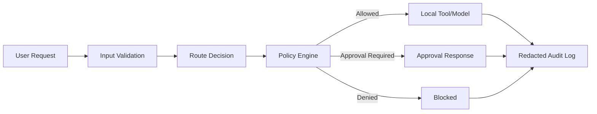

# Security Model

Last updated: 2026-05-06

## Defaults

- Local-only by default.
- No cloud/API calls unless enabled by the user.
- No memory writes without approval.
- No shell commands without approval.
- No file writes without approval.
- No browser automation without approval.
- No package installs without approval.
- No background agents by default.
- No hidden telemetry.
- API keys stored outside code.
- Secrets never logged.
- Dashboard localhost-only unless explicitly configured otherwise.
- All agent actions logged.
- All high-risk actions require approval.

## Risk Levels

| Level | Examples | Default |
| --- | --- | --- |
| Low | Read health state, summarize approved local text, show route plan | Allow if local and non-sensitive |
| Medium | Write memory, edit config, read project files | Approval required |
| High | Shell command, install dependency, external API, web browse, sensitive folder access | Approval required and audited |
| Critical | Delete files, change security settings, expose secrets, background agents, send private data externally | Deny by default; explicit approval and narrow scope required |

## Required Gates

- `shell_command`
- `file_read`
- `file_write`
- `file_delete`
- `git_operation`
- `external_network`
- `cloud_model_call`
- `api_key_use`
- `secret_access`
- `memory_write`
- `service_start`
- `service_stop`
- `model_download`
- `openhands_task`

## Security Architecture

## Secure Defaults Checklist

- [ ] Cloud disabled unless explicitly enabled.
- [ ] External provider keys never printed.
- [ ] Localhost bindings checked.
- [ ] Memory writes require approval.
- [ ] Magic Mode v1 does not execute.
- [ ] Dashboard does not show raw secrets.
- [ ] Bug reports redacted.
- [ ] Gitleaks runs in CI.
- [ ] CI blocks Python, shell, config, and secret regressions.
- [ ] 8GB tier warns before heavy services.

## Highest Security Risks

1. OpenHands has Docker socket access.
2. n8n workflows can call external systems.
3. Cloud provider calls can leak prompt data.
4. Shell/file/git actions can change the machine or repo.
5. Memory poisoning can make Merlin trust bad data.
6. Dashboard mutation controls can become a privileged attack surface.

## v1 Security Ruling

Magic Mode remains plan-only. Execution adapters wait until policy, approval, audit, dashboard UX, and rollback behavior are proven.
