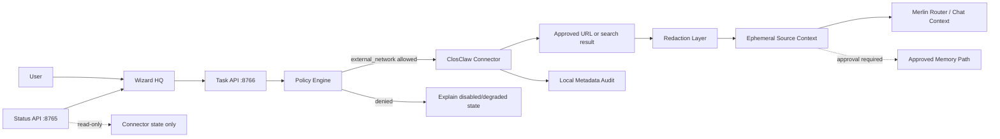

# ClosClaw Web Comprehension Design

**Status:** Future design for #121. No runtime implementation exists yet.
**Updated:** 2026-05-08
**Milestone:** v3.7 Local Fallback + DR

ClosClaw is the working name for a Merlin-owned web comprehension connector. Its
purpose is to let Merlin read external sources only when the user explicitly
allows network access, then return structured, redacted, citation-ready context
to the Merlin task flow.

ClosClaw is not a crawler, browser automation layer, search engine replacement,
or cloud telemetry feature. It must not weaken Merlin's local-first defaults.

## Product Boundary

Current Merlin should continue to work without ClosClaw. When ClosClaw is not
enabled, Wizard HQ should explain that current external web reading requires an
explicit approval path.

ClosClaw may later support:

- user-provided URL reading,
- approved search-result fetching,
- citation metadata extraction,
- redacted page summaries,
- offline/degraded status when network is disabled,
- ephemeral prompt enrichment for Merlin Chat.

ClosClaw must not support:

- default-enabled external network access,
- background crawling,
- browser automation,
- raw secret or prompt logging,
- silent memory writes,
- routing confidence changes,
- cloud telemetry,
- direct browser-side fetch controls.

## Security Contract

External network access is denied by default. Any future fetch action must pass
through the execution-aware backend and require the `external_network` policy
gate.

Required gates and controls:

| Control | Rule |
| --- | --- |
| `external_network` | Required before URL fetch or search-result fetch. |
| `cloud_model_call` | Required only if an external model/provider is used. |
| `api_key_use` | Required only if a provider key is needed. |
| Redaction | Run before prompt enrichment, memory writes, logs, or audit trails. |
| Audit | Metadata only by default: source domain, URL hash, status, gate result. |
| Memory | No write unless the existing approval-gated memory path approves it. |
| 8765 | Remains read-only status. No fetch action belongs here. |
| 8766 | Future action path only after policy gate, audit, and rollback exist. |

## User Flow

1. User asks Merlin for current-source help or provides a URL.
2. Wizard HQ shows that external source reading is disabled by default.
3. User may allow once, deny, or later enable a policy-scoped connector.
4. Backend evaluates `external_network` and related gates.
5. ClosClaw fetches only the approved source or approved result set.
6. ClosClaw redacts sensitive values before any downstream use.
7. Merlin receives structured context with source/citation metadata.
8. Any memory write remains separate and approval-gated.

## Future-State Architecture

This diagram is future-state for #121. It does not describe current runtime
behavior.



## Data Shape

A future `ClosClawResult` should use structured fields rather than raw page
dumps:

```text
source_domain
url_hash
title
snippet
main_text_redacted
published_date
retrieved_at
status
redaction_applied
citations
policy_gate_id
audit_event_id
```

Raw URLs may be shown to the user only when they supplied them or approved the
fetch. Logs should prefer URL hashes and domains.

## Wizard HQ Copy Requirements

Wizard HQ should use plain language:

- Disabled: "Web source reading is off. Merlin will use local knowledge unless
  you allow a source check."
- Approval needed: "Merlin needs permission before reading this external
  source."
- Allowed once: "This source check is allowed for this request only."
- Degraded/offline: "External sources are unavailable. Merlin can continue with
  local context."

Wizard HQ must not say "ready", "online", or "source verified" until the
backend confirms the relevant condition.

## Rollback / Off Switch

The safe fallback is to disable the connector policy. With ClosClaw disabled:

- no external fetch is attempted,
- no browser-side controls appear,
- Merlin continues local-only,
- Wizard HQ shows a degraded or disabled explanation,
- previous metadata audit entries remain local.

## Implementation Split

Before runtime code is written, split #121 into child issues:

1. Status-only Wizard HQ copy for disabled/offline source reading.
2. Backend policy contract and audit payload.
3. Redaction test corpus and metadata-only logging.
4. URL-only approved fetch prototype.
5. Search-result fetch prototype behind the same policy gate.

Each implementation child must include static tests for no-default-network,
no-secret-logging, redaction, offline/degraded state, and no browser shell
execution.
