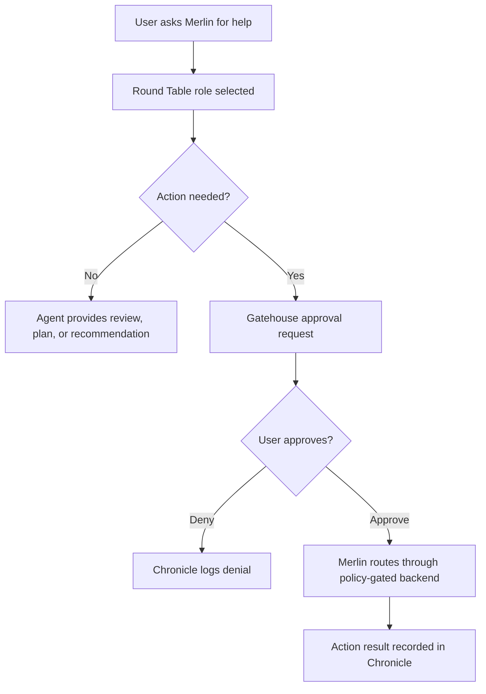

# Round Table Agent Governance

Status: CURRENT governance spec, FUTURE runtime implementation
Updated: 2026-05-10
Owning issue: #133

## Purpose

Round Table agents are Merlin's project helpers. They keep the product focused,
review work from different angles, and prepare recommendations while preserving
human control.

They are not autonomous workers by default. They do not run while the user is
asleep unless a future issue defines a narrow, revocable, evidence-backed mode.

## Product Boundary

Round Table supports the current Merlin focus:

- local-first private AI brain,
- Wizard HQ clarity,
- Room-scoped context,
- approval-gated memory,
- release evidence,
- security-first development discipline.

Round Table must not become a reason to restart deferred work such as native
automation, enterprise governance, broad connectors, or unattended execution.

## Agent Roster

| Agent | Role | Default capability | Must not do |
| --- | --- | --- | --- |
| Product Steward | Roadmap and issue focus | Suggest priorities, scope cuts, acceptance criteria | Claim public beta readiness |
| Scrum Steward | Sprint hygiene | Break work into small PR slices and track blockers | Create giant mixed-scope plans |
| UX Scribe | Wizard HQ and user clarity | Draft UI copy, flow notes, Room/chat improvements | Hide readiness or overload chat |
| Security Warden | Privacy and policy boundaries | Review no-cloud, no-secret, approval-gate risks | Enable cloud or execution by default |
| QA Sentinel | Tests and failure learning | Propose tests, runbooks, evidence requirements | Mark work ready without evidence |
| Smith | Code/build reviewer | Propose patches and test strategy | Write files or run commands without approval |
| Market Scout | Positioning and customer signal | Summarize market/customer direction for planning | Trigger external research by default |

## Permission Model

Default state is suggest-only.

## Allowed Today

- Read docs and issue context.
- Recommend next issue order.
- Produce checklists.
- Draft acceptance criteria.
- Draft UI copy.
- Draft tests and runbooks.
- Review changed files.
- Summarize failures into reusable lessons.

## Locked Until Future Issues

- Browser-side execution controls.
- Shell/file/network actions from Wizard HQ.
- Background autonomous coding.
- Prompt-based Room deletion without an approval card.
- Cross-Room context sharing.
- Memory writes without approve/edit/deny.
- Cloud research or API calls by default.
- Native MerlinFlow automation.

## Project Agent Loop

For each development session:

1. Product Steward confirms the issue improves the local brain/value demo.
2. Security Warden checks local-first, secret, memory, and approval boundaries.
3. Smith proposes the smallest implementation slice.
4. QA Sentinel defines tests before signoff.
5. UX Scribe checks whether the user can understand the result.
6. Scrum Steward records blockers, next steps, and evidence.

No role may override the no-go rules. Any role can stop the build if a change
would silently store memory, enable cloud by default, fake readiness, bypass
8766 policy gates, or claim release readiness without evidence.

## Room Context Rule

Round Table agents may use Room context only after the user selects a Room and a
future context approval flow marks the Room Master Prompt as approved for
context reuse.

Until the Room Master Prompt as approved for context reuse exists, saved
transcripts and draft Room Master Prompts are local artifacts only.

## Evidence Rule

Every Round Table-assisted change must leave evidence:

- target issue,
- files changed,
- protected files touched,
- commands run,
- pass/fail summary,
- failures and lessons learned,
- next recommended issue.

## First Implementation Slice

The first runtime slice should be a read-only Round Table panel in Wizard HQ:

- show the roster,
- show each role's default permission,
- show that agents are suggest-only,
- show no execution controls,
- link to Room, approval, and evidence docs.

No agent execution API should be added in that first slice.
