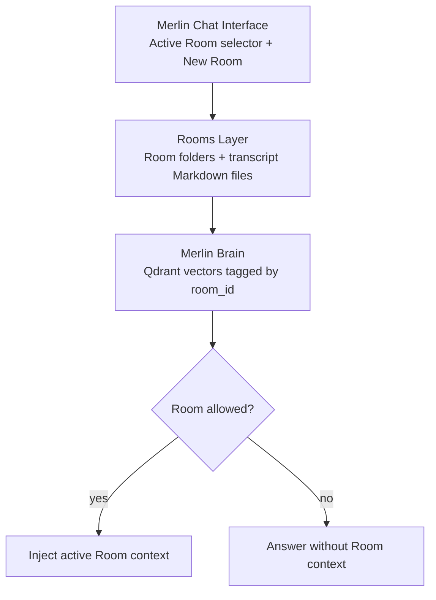

# Merlin AI Future Ideas

Last updated: 2026-05-13
Status: Parking lot, not v1.0 scope

This file is where good ideas wait. Nothing here is dead. Nothing here is a
current release promise.

The v1.0 product has only five jobs:

1. Install everything in one shot.
2. Tell the user it worked.
3. Keep everything private by default.
4. Recover gracefully when something breaks.
5. Uninstall cleanly.

Any feature that does not directly improve one of those jobs belongs here until
the clean Mac install and first-run experience are proven.

## Future Product Features

| Idea | Earliest condition |
| --- | --- |
| Merlin Rooms as durable project spaces | After onboarding and clean install are proven |
| Export/Import Brain | After saved local data is stable and easy to locate |
| Voice mode and animated orb response | After local chat works and local audio consent is designed |
| Home Assistant integration | After private AI first-run is trusted |
| Linux installer | After macOS v1.0 quality is stable |
| Windows support | After macOS and Linux paths are proven |
| Mobile companion or LAN access | Only opt-in, after localhost defaults are trusted |
| Provider/API connector setup | After no-cloud default and secret storage UX are tested |
| Model library / model downloads | After hardware warnings and no-surprise-download tests are mature |
| Supervised agents | Suggest-only first, after approvals are understandable |
| Native automation runtime | After real user workflows prove what Merlin should own |
| Professional evidence mode | After consumer install/onboarding/recovery are solid |
| Multi-user administration | After single-user owner flow is polished |
| **Claude Code local CLI adapter** | After `coding` profile (OpenHands) is stable and hardware-tier routing is live |
| **Open Design local artifact generator** | After `coding` profile is stable and Claude Code local adapter is validated |

## Claude Code Local CLI Adapter

Phase: v1.5 / `coding` profile extension
Earliest condition: `coding` profile (OpenHands) stable + `hardware_probe` tier routing live (PR #139)

### What it is

Claude Code is Anthropic's agentic coding CLI. A local adapter points it at
Ollama's OpenAI-compatible loopback endpoint instead of Anthropic's cloud API.
Zero tokens leave the machine. Zero billing. The user gets Claude Code's full
file-editing, test-running, and Git-aware workflow powered by a local model.

Validated open-source pattern: [nicedreamzapp/claude-code-local](https://github.com/nicedreamzapp/claude-code-local)
— MLX server (Apple Silicon) or Ollama loopback (cross-platform). MIT license.

### Hardware fit (from `hardware_probe` tier map)

| Tier | RAM | Recommended model | Claude Code usability |
|---|---|---|---|
| high | 48GB+ | Qwen 2.5 Coder 32B / Llama 3.3 70B | Full agentic, multi-file refactor |
| mid | 24–47GB | Qwen 2.5 Coder 14B | Single-file edits, code review |
| base | 16–23GB | Qwen 2.5 Coder 7B | Autocomplete, documentation, Q&A |
| low | 8–15GB | Qwen 2.5 7B Q4 | Light tasks; human review required |
| unsupported | <8GB | Route to explicit user opt-in only | Not recommended without approval |

### What Merlin adds over the raw pattern

- Ollama bound to `127.0.0.1` only — port blocked at host firewall.
- `hardware_probe` auto-selects model tier at startup — no manual config.
- Prompt hygiene policy: no PII/NPI in prompts (GLBA Safeguards Rule alignment).
- Audit log → SIEM: all Claude Code sessions logged to `merlin-route-decisions.jsonl`.
- Model registry with SHA256 checksums — treated as software under change management.
- AUP clause: Q4 quantized models are ~10–15% less accurate on complex tasks;
human review required for security-sensitive code.

### Merlin install flow (future)

```bash
# User enables the coding profile
bash scripts/enable-profile.sh coding

# Merlin detects hardware tier and pulls the right model
bash scripts/add-model.sh   # guided by /status/hardware tier

# Claude Code CLI is configured to loopback automatically
bash scripts/setup-claude-code-local.sh
```

### Protected rules

- Do not route Claude Code to any cloud endpoint without explicit user approval
  and a visible policy gate.
- Do not auto-download a model during Claude Code setup without the hardware
  tier warning shown first.
- Do not enable Claude Code on `unsupported` (<8GB) tier without explicit
  user acknowledgment.

---

## Open Design Local Artifact Generator

Phase: v2.0 / `coding` profile extension
Earliest condition: Claude Code local adapter validated above

### What it is

Open Design ([nexu-io/open-design](https://github.com/nexu-io/open-design)) is
an Apache-2.0, local-first open-source clone of Anthropic's Claude Design.
It turns a text prompt into a fully interactive HTML/UI artifact — prototypes,
slides, landing pages, pitch decks — using your existing coding agent CLI
(Claude Code, Cursor, Codex, or 13 others) as the generation engine.

Shipped April 2026. 71+ brand-grade design systems. 19 skills. Vercel-deployable
or fully local. BYOK at every layer.

Reference: [opendesigner.io](https://opendesigner.io) · [GitHub](https://github.com/nexu-io/open-design)

### Why it fits the Merlin stack

- Local-first, zero cloud required — aligns with Merlin's privacy architecture.
- BYOK: uses Ollama or any OpenAI-compatible endpoint already running in Merlin.
- Apache-2.0 license — no legal barrier to internal or commercial wrapping.
- Auto-detects Claude Code CLI if already configured — no separate setup.
- Outputs static HTML artifacts — no cloud storage, no data egress.

### Platform notes

- **macOS Apple Silicon (2020+):** Primary target. Claude Code local + MLX
  backend gives highest throughput. Open Design auto-detects the CLI.
- **Windows / Linux:** Deferred to v2.0/v2.5 per the milestone ladder. Works
  cross-platform once those installers exist and Ollama loopback is configured.

### What Merlin adds

- Hardware-tier gate: show Open Design option only when tier is `base` or above.
- Policy gate: artifact generation session logged to audit trail.
- Approval gate: `file_write` approval required before saving generated artifacts
  to the local filesystem.
- Dashboard visibility: Open Design run status surfaced in Wizard HQ alongside
  other coding profile tools.

### Protected rules

- Do not enable Open Design if Claude Code local adapter is not yet configured.
- Do not write generated artifacts outside the user's approved local path without
  explicit approval.
- Do not connect Open Design to any cloud model endpoint without a visible policy
  gate and user opt-in.

---

## Merlin Rooms Direction

Rooms should borrow the best part of Obsidian: user-owned local files that are
easy to find, move, back up, and delete. Merlin should not become a notes app.
Merlin should be the assistant that can use a chosen local Room when the user
allows it.

Future Rooms behavior:

- The chat surface always shows the active Room and a simple New Room action.
- Merlin announces the active Room in plain English, for example: "You're in
  WIZARD Patent. I have 12 saved sessions here."
- A Room contains multiple local transcript files.
- Each transcript can produce a separate Room Master Prompt draft after user
  approval.
- Qdrant vectors are tagged by `room_id`.
- Room context is injected only when the Room is allowed by policy.
- Similar Rooms are suggested before a new near-duplicate Room is created.
- General chat remains available without persistent context.



Non-negotiable guardrails:

- Saving transcript history is not the same as approved memory.
- Deleting a transcript must delete the local transcript file.
- Deleting a Room must show what will be removed before approval.
- Synced folders are allowed only as local filesystem paths; they do not mean
  cloud inference is enabled.
- The default remains private and local.

### Five Behaviors That Make Rooms Feel Right

| Behavior | What it looks like | What it needs |
| --- | --- | --- |
| Room header | Chat always shows `Room: WIZARD Patent` | UI label bound to active Room |
| Merlin announces | First message says "You're in WIZARD Patent. I have 12 sessions here." | System prompt injection on Room load |
| Auto-context load | Merlin remembers prior Room sessions without the user re-explaining | Qdrant query filtered by `room_id` on session start |
| Room tab management | Rename Room, delete Room, delete individual transcripts | Simple CRUD UI in the Rooms tab |
| Memory merge | Similar context across sessions collapses into one clean node | Cosine similarity threshold dedup job in Qdrant |

### Issue-Ready Backlog

Do not open these as active v1.0 issues until the five v1.0 jobs are proven.
They are written here so the product direction is reusable when Rooms are
promoted from future idea to planned work.

#### Merlin Rooms: Persistent Encrypted Context Spaces

- Phase: v2.0 / core
- Goal: Create durable local Room spaces for topic-scoped chat history and
  future approved context.
- Scope:
  - Room creation, naming, switching, and active Room display from Merlin Chat.
  - `room_id` tagging on Room transcript metadata and future Qdrant vectors.
  - Room-level storage path and encryption design.
  - Local Markdown transcript storage.
- Out of scope:
  - Automatic memory writes.
  - Cloud sync as inference.
  - Multi-user administration.
- Acceptance criteria:
  - User can create, rename, select, and delete a Room.
  - User can delete an individual transcript and the local file is removed.
  - Merlin Chat always shows the active Room.
  - General chat remains available without persistent context.

#### Room Context Auto-Injection On Session Start

- Phase: v2.0 / core
- Goal: Make Merlin aware of the selected Room without requiring the user to
  re-explain the project each session.
- Scope:
  - On Room entry, query Qdrant using the active `room_id`.
  - Inject top-N approved memories into the system prompt.
  - Merlin's first message announces Room name and saved-session count.
  - UI shows what Room context was used.
- Out of scope:
  - Using unapproved transcript text as memory.
  - Referencing all Rooms by default.
  - Cloud model routing without explicit user opt-in.
- Acceptance criteria:
  - Active Room context is off by default until user allows it.
  - Active Room only, selected Rooms, and all Rooms are separate policy states.
  - Merlin can explain which Room context it used.

#### Memory Deduplication: Merge Similar Context

- Phase: v3.0 / cleanup
- Goal: Keep Merlin's local brain lean as Rooms grow.
- Scope:
  - Scheduled or manual deduplication pass.
  - Cosine similarity threshold, initially `> 0.92`, for candidate duplicate
    memory nodes.
  - User-facing summary before or after cleanup, for example: "Merlin cleaned
    14 duplicate memories in WIZARD Patent."
- Out of scope:
  - Silent deletion of user-authored transcripts.
  - Merging memories across Rooms without explicit policy.
  - Training or fine-tuning models.
- Acceptance criteria:
  - Duplicate candidates are reviewable.
  - Cleanup never deletes original transcript files.
  - A regression test proves unrelated Rooms do not merge by default.

One-line pitch:

> It is like iMessage threads, Obsidian vaults, and Merlin's memory becoming the
> same local thing: organized by topic, owned by the user, and clear about where
> Merlin is at all times.

## Future Issue Parking Map

These open issues are future or conditional unless they directly support the
five v1.0 jobs:

- #114, #117, #119, #120: settings depth and backend controls.
- #124, #125: export/import brain.
- #126, #127, #128: connectors, PC task execution, and saved agents.
- #129, #130, #135: model UI, storage UI, and Rooms beyond first-run clarity.
- #136, #137, #138: orb animation and voice-reactive visuals.
- #103, #104, #105, #107, #108, #112, #121: governance/monitoring/fallback
  milestone parents.
- #64: Developer ID signing/notarization, after product quality is stable.
- #92, #111: native automation and MerlinFlow runtime.
- #81 through #84: patent/IP track, handled separately from product v1.0.
- Claude Code local adapter + Open Design: tracked here; no issue opened until
  `coding` profile (OpenHands) is stable and hardware-tier routing (PR #139)
  is merged and proven.

## Rule

Do not promote anything from this file unless it makes the first 30 minutes
better for a nontechnical Mac user.
