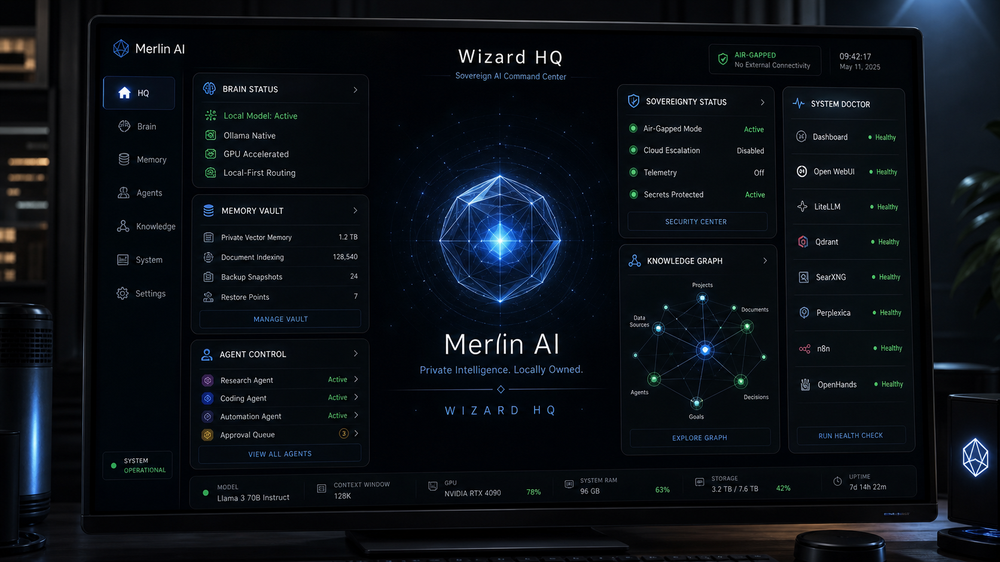
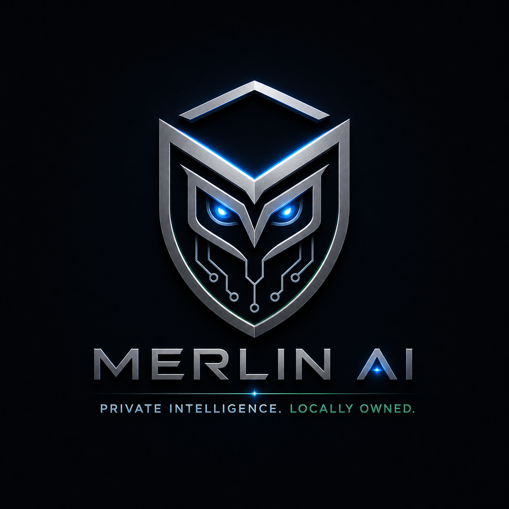

# Merlin AI Brand + Wizard HQ UX Spec

Last updated: 2026-05-07

## Product Position

Merlin AI is a sovereign, local-first personal intelligence system. It should
feel like private cognitive infrastructure running on owned hardware, not a
generic chatbot or cloud SaaS wrapper.

The product promise is:

> Private Intelligence. Locally Owned.

## Experience Target

Wizard HQ is the Merlin-native command center. It combines a calm assistant
surface with operational visibility for local models, memory, agents, approvals,
and system health.

The emotional target is controlled power:

- intelligent but calm
- powerful but permissioned
- futuristic but trustworthy
- secure without feeling militarized
- premium without feeling corporate

## Visual Direction

Use a luxury local-AI operating-system language:

- obsidian black and midnight graphite surfaces
- silver-titanium linework
- restrained electric-blue glow
- sparse deep-emerald health accents
- compact executive-grade panels
- subtle geometric intelligence core

Avoid fantasy wizard tropes, cartoon mascots, gamer HUDs, generic AI brain
icons, crypto-style clutter, or anything that implies autonomous execution.

## Wizard HQ MVP Modules

The v2.1 dashboard should make these modules visible without adding privileged
actions:

- **Brain Status:** local model, Ollama native runtime, acceleration state,
  local-first routing.
- **Memory Vault:** private vector memory and collection health. Review/delete
  interactions wait for policy-gated backend flows.
- **Agent Control:** research, coding, and automation agents shown as guarded or
  standby; no execution buttons in v1.
- **Sovereignty Status:** air-gapped/local-only posture, cloud disabled,
  telemetry off, protected values not displayed.
- **Knowledge Graph:** concept placeholder for linked projects, documents,
  goals, and decisions. Interactive graph work is post-MVP.
- **System Doctor:** dashboard, Open WebUI, LiteLLM, Qdrant, Ollama, and Merlin
  API health from localhost-only status checks.

## Concept Asset

Reference image for the v2.1 visual north-star:

Logo concept for installer, downloader, dashboard header, app icon, and hardware
badge exploration:

This is product-direction evidence only. The launch dashboard must remain
lightweight, static, and usable on 8 GB Macs.

## Installer + Downloader Brand Requirement

Tracked by GitHub issue #94 under `v3.0 — Public Product Release`.

Before the first public launch test, the installer/downloader path should show
the Merlin AI mark and product name so the user understands they are installing
the sovereign local AI system, not a generic script bundle.

This work belongs in the public-release packaging milestone, not in the read-only
dashboard slice. The protected installer should only be changed through a
dedicated packaging issue with tests for:

- branded welcome/summary surface where the packaging format supports it
- CLI downloader/banner fallback for terminal installs
- no installer flow regressions
- no extra network calls
- no model downloads unless explicitly confirmed
- uninstall path unaffected

### Implemented Surface

The #94 implementation keeps installer behavior unchanged and adds the Merlin
brand only to user-facing package and terminal surfaces:

- terminal `install.sh` header: Merlin AI name, tagline, and local-first
  positioning
- macOS package welcome screen: Merlin AI mark, tagline, Wizard HQ, and no-cloud
  default language
- macOS package readme: first-run Wizard HQ path, doctor/status commands, and
  corrected local service map
- postinstall Desktop next-steps file: Merlin completion heading and Wizard HQ
  service URL
- `pkg/resources/merlin-ai-logo.png`: package-local M logo resource derived from
  the approved concept asset
- `tests/installer-branding-smoke.sh`: static regression coverage wired into CI

## Launch Guardrails

- Dashboard v1 is read-only.
- No shell, file, memory-write, approval, model-download, or Magic Mode
  execution controls appear in the browser.
- All risky actions stay behind Merlin policy gates and the CLI/API approval
  model.
- No raw prompts, model responses, or sensitive values are stored in browser
  logs.
- Port 8765 remains the legacy read-only status server; port 8766 remains the
  execution-aware FastAPI status/task API.
