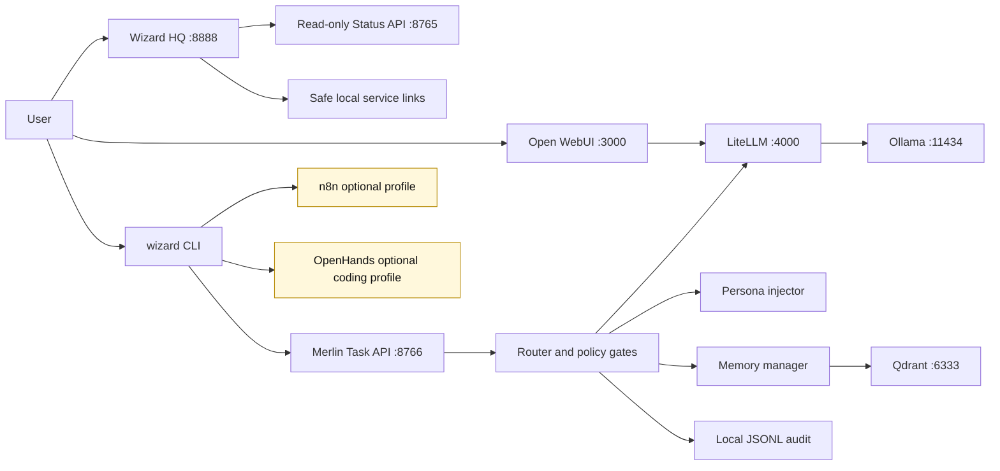
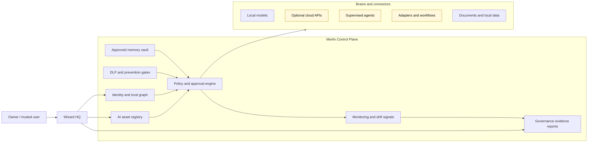

# Merlin AI Control Plane Strategy

Last verified: 2026-05-09
Status: Product strategy and milestone alignment

This document validates the commercial direction for Merlin AI against the
current repository state. It is not a claim that all future controls exist
today. Current-state behavior remains governed by
`docs/CANONICAL_PROJECT_STATE.md`.

## Direction

Merlin AI should evolve from a local-first AI stack into a private AI control
plane:

- a Merlin-native Wizard HQ front door,
- Merlin Chat as the default conversation surface,
- Rooms for local chat history and scoped project context,
- approval-gated memory extraction from saved conversations,
- a local model and provider registry,
- approval-gated memory and action governance,
- AI asset inventory,
- identity and trust graph,
- policy and access reviews,
- monitoring, drift, and incident signals,
- DLP-style prevention gates,
- governance evidence and reports,
- optional native automation runtime after workflows prove the shape.

The strongest wedge is not "another chatbot" and not "a pile of AI tools." The
wedge is a private AI that remembers the user's work in local Rooms, lets the
user choose what becomes durable memory, and makes local models, optional cloud
providers, agents, and automation visible and governable from one command
center. Cloud providers remain optional connectors, never defaults. In roadmap
terms, cloud providers are optional future/connector scope, not the core
product loop.

## Validated Market Signals

These signals support the direction, but they should be treated as planning
inputs, not investor-ready financial proof:

- MarketsandMarkets projects the AI governance market growing from USD 0.89B in
  2024 to USD 5.78B by 2029 at 45.3% CAGR.
- IBM's 2025 Cost of a Data Breach research highlights an AI oversight gap:
  97% of organizations reporting an AI-related incident lacked proper AI
  access controls, and 63% lacked AI governance policies.
- IBM also reports that one in five organizations reported a breach due to
  shadow AI, with high shadow-AI environments seeing materially higher breach
  costs.
- OWASP LLM risk categories support Merlin's control-plane roadmap: prompt
  injection, sensitive information disclosure, supply chain risk, improper
  output handling, excessive agency, vector and embedding weaknesses, and
  unbounded consumption.
- GitHub Copilot pricing and policy posture show that users already pay for AI
  assistants, while business buyers care about policy, governance, data use,
  and administrative control.

Reference URLs:

- https://www.marketsandmarkets.com/Market-Reports/ai-governance-market-176187291.html
- https://www.ibm.com/reports/data-breach
- https://www.prnewswire.com/news-releases/ibm-report-13-of-organizations-reported-breaches-of-ai-models-or-applications-97-of-which-reported-lacking-proper-ai-access-controls-302516664.html
- https://owasp.org/www-project-top-10-for-large-language-model-applications
- https://github.com/features/copilot/plans

## What Exists Today

Current Merlin has the foundation for this direction:

- protected installer, uninstall, upgrade, and local package paths,
- Wizard HQ static dashboard with Merlin-native tab shell,
- local Ollama, LiteLLM, Open WebUI, Qdrant, optional n8n, optional OpenHands,
- read-only status API on port 8765,
- execution-aware task API on port 8766,
- Merlin Staff Core routing, policy gates, persona injection, and memory manager,
- approval-gated memory writes and audit trails,
- local JSONL observability plus optional local Langfuse profile,
- failure-learning evidence process and trusted local beta evidence pack.

Current Merlin does not yet provide:

- durable Merlin-native chat history,
- Rooms/project context containers,
- export/import brain,
- production DLP blocking,
- automatic AI asset discovery,
- multi-user RBAC,
- enterprise access reviews,
- IDS/IPS enforcement,
- SIEM-grade incident reporting,
- native MerlinFlow execution runtime,
- signed/notarized public installer.

## Current-State Architecture

## Future-State Control Plane

This future-state diagram is not current product behavior. It is the target
shape for v3.1 through v4.x.

## Milestone Ladder

| Milestone | Working Title | Product Outcome |
| --- | --- | --- |
| v3.0 | Public Product Release hardening | Installer, evidence, onboarding, Wizard HQ foundation, local trusted beta path |
| v3.1 | Wizard HQ Product Shell, issues #106 and #135 | Merlin-native product surface with Chat, Rooms, Brains, Memory, Agents, Security, System, Settings |
| v3.2 | AI Asset Inventory + Identity Graph, issue #105 | Inventory of local models, providers, tools, agents, and trust state |
| v3.3 | Access Control + Reviews, issue #103 | Actor/resource permissions, approval history, review workflows |
| v3.4 | Monitoring, IDS Signals + Drift, issue #104 | Activity events, anomaly signals, failed gate trends, drift baseline |
| v3.5 | DLP + Prevention Gates, issue #107 | Prompt/output data classification, redaction, block/approve policy gates |
| v3.6 | Governance Reporting + Evidence, issue #112 | Exportable inventory, access, incident, and policy evidence packs |
| v3.7 | Local Fallback + DR, issue #108 | Provider health, offline fallback state, recovery and continuity proof |
| v4.x | MerlinFlow Native Runtime, issue #111 | Policy-gated native workflow execution after n8n patterns prove what to own |

## Sprint Structure

Each milestone should open with a design/readiness sprint and close with an
evidence sprint:

1. Scope and threat model.
2. Data model and API contract.
3. Wizard HQ user flow.
4. Static smoke tests.
5. Live smoke tests where appropriate.
6. Evidence note and issue closeout.

For v3.1, the first sprint remains product-shell work, not enterprise security:

- close the first-run status persistence gap,
- validate Wizard HQ visually in a browser,
- design Merlin Rooms, local chat history, and save-to-Room memory boundaries,
- make Brains show model/provider status honestly,
- keep Open WebUI as a brain option rather than Merlin's identity,
- avoid browser execution controls until policy-gated APIs are ready.

## Do Not Build Yet

- Native MerlinFlow execution runtime before v3.1-v3.7 prove the owned control
  plane shape.
- ClosClaw/web comprehension before Merlin Chat, Rooms, and memory review are
  useful.
- More provider/cloud routing UI unless it directly supports the Merlin
  Chat/Rooms loop.
- Enterprise RBAC before a single-user owner workflow is clear.
- DLP blocking before data classification, false-positive handling, and local
  evidence are designed.
- Cloud connectors by default.
- Telemetry by default.
- Automatic model downloads after install.
- Browser-side task execution that bypasses port 8766 policy gates.
- Investor/public-release claims that outpace installer and evidence results.

## Release Claims Rule

Merlin can be described today as a local-first AI control plane foundation.

Merlin should not yet be described as a completed AI firewall, IDS, IPS, DLP,
enterprise governance suite, or public-release product. Those are roadmap
outcomes that require their own issues, tests, evidence, and release gates.
